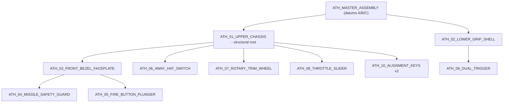

# DESIGN SPECIFICATION — Aero-Throttle (Prototype 01)

**Document status:** Phase 1 — Design Architecture (no implementation code released)
**Supersedes:** `DESIGN_SPEC.md` skeleton
**Normative inputs:** `PROJECT.md`, `idea/Aero Throttle CAD Design Specification.md` (PRD v2.0), `idea/Fidget Toy Prototypes Portfolio.md` (Prototype 1), hero render + concept sketch (see `PROJECT.md` → References)
**Companion documents:** `PARAMETERS.md` (parameter registry), `design/ALGORITHM.md` (geometry generation algorithms)

> **Reading order for the implementation agent:** §2 (datums) → §5 (fits) → §6 (material model) → §7 (compliant mechanisms) → §8 (parts) → `PARAMETERS.md` → `design/ALGORITHM.md`.
> **§13 is mandatory reading:** the PRD contains dimension sets that are geometrically or mechanically impossible. §13 lists every superseded value with its replacement and reason. Where §13 and the PRD disagree, **§13 governs.**

---

## 1. Scope, Intent and Success Definition

### 1.1 Product intent
A hand-held, single-hand-operated mechanical fidget device styled as a fighter-jet HOTAS grip. Ten printed parts, no fasteners, no metal springs, no adhesive, no bearings. All tactile force, detent, return and acoustic feedback is produced by integral polymer compliant mechanisms.

### 1.2 What "done" means
The design is complete when **every** clause below holds. A successful OpenSCAD render is not evidence of any of them.

| # | Success criterion | Verified by |
| :-- | :-- | :-- |
| S-1 | Ten distinct solid bodies, each watertight, single connected component, non-self-intersecting, positive volume | V-100 … V-104 |
| S-2 | Assembled bounding box = 86.0 × 72.0 × 26.5 mm ±0.30 mm | V-110 |
| S-3 | No static interference between any pair of parts at any point in their motion envelope | V-120 … V-126 |
| S-4 | Every dynamic clearance equals its declared fit class ±0.03 mm | V-130 |
| S-5 | Every flexure satisfies §6.3 stress allowables at its maximum working deflection | V-140 |
| S-6 | Zero geometry exceeding the 45° overhang rule in the declared print orientation | V-150 |
| S-7 | Every parameter in `PARAMETERS.md` rebuilds the assembly across its declared valid range | V-160 |
| S-8 | All six mechanisms deliver their target force/travel within the tolerance band of §7 | V-170 (physical) |

### 1.3 Non-goals
Electronics, magnets, lubricants, multi-material co-printing (colour changes only), and any part requiring support material.

---

## 2. Units, Coordinate System, Datums

### 2.1 Units
* Length: millimetres (mm). Angles: degrees (deg). Force: newtons (N). Torque: N·mm. Stress: MPa. Mass: grams.
* All literals in source are mm unless the identifier carries a unit suffix (`_deg`, `_n`, `_mpa`).
* No imperial units anywhere in the toolchain.

### 2.2 Global (design) coordinate system — **Y-up**
Right-handed Cartesian, as mandated by the project brief:

| Axis | Direction | Meaning |
| :-- | :-- | :-- |
| **+X** | Forward (toward the muzzle/bezel) | Length axis; throttle slide axis; trigger-pull reference |
| **+Y** | Up (toward the crown/top deck) | Height axis; button press axis is −Y at the hat, −X at the fire button |
| **+Z** | Toward the **mechanism flank** (operator's thumb side) | Width/lateral axis; all pivot axes for the trim wheel, trigger and missile guard are parallel to Z |

`+Z` is the flank carrying the throttle rail and the trim wheel. Handedness is parametric (`handedness = +1` right-hand grip, `−1` mirrors the entire assembly about Z=0).

> **Design CS is Y-up; OpenSCAD's print CS is Z-up.** Each part is authored in the global Y-up design CS and emitted through a single per-part `to_print_cs()` transform (§10.4). No part is authored twice.

### 2.3 Global origin
`O = (0, 0, 0)` is the intersection of three orthogonal datum planes:

| Datum | Plane | Definition |
| :-- | :-- | :-- |
| **A** | Y = 0 | **Split-seam plane** — the mating plane between `ATH_01_UPPER_CHASSIS` and `ATH_02_LOWER_GRIP_SHELL`. Primary assembly datum. |
| **B** | X = 0 | **Chassis rear face** — the rearmost plane of the upper chassis and of the whole assembly. |
| **C** | Z = 0 | **Lateral symmetry plane** of the upper chassis. |

Datum precedence for all fits: **A → B → C** (seam flatness first, then longitudinal station, then lateral centring).

### 2.4 Secondary datums (per feature)
| Datum | Definition | Owner |
| :-- | :-- | :-- |
| D | Chassis front face, X = `chassis_length` = 82.0 | ATH_01 |
| E | Top deck plane, Y = `chassis_height` = 36.0 | ATH_01 |
| F | Mechanism flank plane, Z = +`chassis_width`/2 = +13.25 | ATH_01 |
| G | Throttle rail root plane (dovetail mouth), Z = 13.25 − `rail_depth` | ATH_01 |
| H | Bezel front face, X = 84.0 | ATH_03 |
| J | Trigger pivot axis, line (X = 58.0, Y = −4.0, Z ∈ ℝ) | ATH_02 |
| K | Trim wheel rotation axis, line (X = 61.0, Y = 8.80, Z ∈ ℝ) | ATH_01 |
| L | Hat gimbal centre, point (46.0, 30.5, 0) | ATH_01 |

---

## 3. Master Dimensional Budget

Every overall dimension is a **closed chain of parameters**, not an independent number. The implementation must assert each chain (V-110).

### 3.1 X chain (length, 86.0 mm)
```
overall_length = chassis_length + bezel_protrusion + (guard_hood_h - guard_recess_depth)
              =    82.0        +      2.00        + (    4.50     -      2.50       ) = 86.00 ✔
```
* `X = 0` chassis rear face (assembly rearmost).
* `X = 82.0` chassis front face (datum D).
* `X = 84.0` bezel front face (datum H) — bezel stands 2.00 mm proud.
* `X = 86.0` closed missile guard outer face (assembly foremost).

### 3.2 Y chain (height, 72.0 mm)
```
overall_height = hat_cap_protrusion + chassis_height + grip_drop
               =       6.00         +     36.00      +   30.00   = 72.00 ✔
```
* `Y = +42.0` hat switch cap crown (assembly topmost).
* `Y = +36.0` top deck (datum E).
* `Y = 0` split seam (datum A).
* `Y = −30.0` grip butt (assembly bottommost).

### 3.3 Z chain (width, 26.5 mm)
```
overall_width = chassis_width = 26.5,  Z ∈ [-13.25, +13.25]
```
Nothing may protrude laterally past `±chassis_width/2`. The throttle thumb tab, the trim wheel and the grip palm swell are all bounded by this plane; the tab and wheel are **recessed**, never proud (V-110c).

### 3.4 Longitudinal packaging map of the +Z flank (interference-critical)
The flank is the most congested surface in the design. Stations along X:

| X range | Occupant | Y range | Z range |
| :-- | :-- | :-- | :-- |
| 3.0 … 47.0 | Throttle dovetail rail (`rail_len` = 44.0) | 15.75 … 28.25 | 4.10 … 13.25 |
| 49.0 … 73.0 | Trim wheel pocket (⌀24.0) | −3.2 … 20.8 | 5.25 … 13.25 |
| 72.0 … 82.0 | Front bezel receiving collar | 12.0 … 32.0 | −9.0 … +9.0 |
| 36.75 … 55.25 | Hat switch recess (⌀18.5, on datum E) | 30.5 … 36.0 | −9.25 … +9.25 |

**Mandatory clearance assertions (V-121):**
* rail front end (47.0) → wheel pocket rear (49.0): **2.00 mm** wall ≥ `wall_internal_min` (1.80) ✔
* wheel pocket top (Y 20.8) → rail bottom (Y 17.0): non-overlapping in X, no check needed; where X overlaps, ≥1.80 mm ✔
* wheel pocket front (73.0) → collar rear (72.0): overlap only where wheel Y ≤ 8.8 and collar Y ≥ 12.0 → **3.20 mm** separation ✔
* hat recess floor (Y 30.5) → rail channel top (Y 28.25): **2.25 mm** ✔

---

## 4. Assembly Hierarchy, Kinematics and Assembly Sequence

### 4.1 Hierarchy


`ATH_01_UPPER_CHASSIS` is the **structural root**: every other part is positioned by a transform whose parent chain terminates at ATH_01. No part is positioned by a literal coordinate triple.

### 4.2 Kinematic constraint matrix (normative)

| Moving part | Parent | Joint | DOF | Axis / direction | Travel limits | Target force at the contact point |
| :-- | :-- | :-- | :-- | :-- | :-- | :-- |
| ATH_08 throttle slider | ATH_01 | Prismatic | 1T | +X, on datum G | 0 to 28.0 mm | 0.80 N glide; 4.30 N at afterburner break |
| ATH_06 hat switch | ATH_01 | Spherical, 2 DOF used | 2R | theta_x, theta_z about L | +/-14.0 deg each | 2.80 N tilt / self-centring |
| ATH_07 trim wheel | ATH_01 | Revolute | 1R | parallel Z through K | continuous 360 deg | 12.0 N.mm ratchet torque, 20 clicks/rev |
| ATH_04 missile guard | ATH_03 | Revolute | 1R | parallel Z, bezel hinge | 0 to 100 deg (detents 0, 90) | bi-stable over-centre |
| ATH_05 fire button | ATH_03 | Prismatic | 1T | -X | 0 to 3.50 mm | 3.20 N at full stroke |
| ATH_09 trigger | ATH_02 | Revolute | 1R | parallel Z through J | 0 to 15.0 deg | Stage 1: 1.60 N @ 3.0 mm; Stage 2: 5.20 N break |
| ATH_03 bezel | ATH_01 | Rigid snap | 0 | - | - | permanent, 2 barbs |
| ATH_02 grip shell | ATH_01 | Rigid snap | 0 | - | - | 4 hooks + 2 keys |
| ATH_10 keys (x2) | ATH_01/02 | Rigid, shear | 0 | - | - | press fit +0.10 mm/side |

### 4.3 Assembly sequence (defines which snap features must be reversible)

| Step | Action | Snap type | Reversible? |
| :-- | :-- | :-- | :-- |
| 1 | Press ATH_07 trim wheel onto the chassis snap post (lateral, +Z to -Z) | Mushroom snap head, 4 relief slots | No (service only by cutting) |
| 2 | Slide ATH_08 throttle carriage into the rail from the rail's **rear** end | Dovetail capture + end stop tab | Yes (slide out rearward) |
| 3 | Drop ATH_06 hat switch into the deck cradle; rotate 45 deg to lock the star arms under the retention lip | Bayonet, 45 deg | Yes |
| 4 | Press ATH_05 fire button rearward through the ATH_03 bezel bore until the flange clears the retaining shoulder | Flange-over-shoulder | No |
| 5 | Press ATH_04 guard hinge pins into the ATH_03 stanchion holes (lateral spread) | Snap pin | Yes |
| 6 | Press the ATH_03 bezel sub-assembly onto the chassis snout collar | 2 barbs, 0.80 mm undercut | No |
| 7 | Insert ATH_09 trigger trunnions into the ATH_02 grip cradle (lateral spread of the cradle walls) | Open-mouth snap cradle | Yes |
| 8 | Insert ATH_10 keys x2 into the chassis seam sockets | Press fit | Yes |
| 9 | Close ATH_02 onto ATH_01 along -Y; 4 hooks engage | Cantilever hook, 0.80 mm undercut | Yes (release via internal ramp; no tool access - see OQ-4) |

**Consequence for the geometry:** steps 1, 4 and 6 are permanent, so those three snap features use a 0 deg (perpendicular) return face; steps 2, 3, 5, 7, 8, 9 use a 45 deg return face to permit disassembly.

---

## 5. Tolerance and Fit Classes (normative)

Every clearance in the model must be produced by **one of these named classes**. A literal gap is a defect.

| Class id | Parameter | Gap per side | Total diametral | Application |
| :-- | :-- | :-- | :-- | :-- |
| FC-SLIDE | `fit_clearance_sliding` | 0.20 | 0.40 | Throttle dovetail flanks; fire-button guide bore |
| FC-ROTARY | `fit_clearance_rotary` | 0.25 | 0.50 | Trim wheel bore/post; hat gimbal ball/cradle |
| FC-SNAP | `fit_clearance_snap` | 0.15 | 0.30 | Snap hooks in catch pockets; bezel barbs; seam tongue-and-groove |
| FC-STATIC | `fit_clearance_static` | 0.10 | 0.20 | Alignment keys; locating ribs |
| FC-PIVOT | `fit_clearance_pivot` | 0.10 | 0.20 | Trigger trunnion; missile-guard hinge pins |
| FC-PRELOAD | `preload_*` (per mechanism) | -0.40 to -0.75 | interference | Ratchet pawl; throttle detent follower |

**FC-PIVOT is a new class** introduced to resolve a direct conflict in the PRD - see §13, D-03. It exists because the trigger and hinge pin pairs are dimensioned explicitly (D3.80/D4.00 and D2.35/D2.50) at 0.10 mm/side, which is tighter than FC-ROTARY. Low backlash is correct for these two joints: they are lever pivots where radial slop is felt directly as lost motion, and their sliding velocity is negligible.

### 5.1 Derived mating dimensions (never hard-coded)

```
throttle_slot_w_female  = throttle_tenon_w_male  + 2*fit_clearance_sliding
fire_btn_bore           = fire_btn_size          + 2*fit_clearance_sliding   = 10.90
trim_bore_d             = trim_post_d            + 2*fit_clearance_rotary    =  5.50
hat_cradle_d            = hat_ball_d             + 2*fit_clearance_rotary    =  8.00
trigger_socket_d        = trigger_trunnion_d     + 2*fit_clearance_pivot     =  4.00
guard_pin_hole_d        = guard_pin_d            + 2*fit_clearance_pivot     =  2.55   [was 2.50 - see D-04]
snap_pocket_w           = snap_hook_w            + 2*fit_clearance_snap      =  3.80
key_socket_side         = key_side               + 2*fit_clearance_static    =  4.20
seam_groove_w           = seam_tongue_thick      + 2*fit_clearance_snap      =  1.50
```

### 5.2 Anisotropy allowance

FDM holes print undersize and bosses oversize. All **internal** cylindrical features carry an additional `hole_comp = +0.10` mm on diameter, applied once, at the point of subtraction, by a single helper (`bore()` in `geometry.scad`). It is **not** folded into the fit-class constants, so that fit classes stay material-independent and `hole_comp` can be retuned per printer.

---

## 6. Material Model and Allowable Stresses

### 6.1 Properties used for all sizing in §7

| Property | PLA+ (primary) | PETG (alt) | Symbol |
| :-- | :-- | :-- | :-- |
| Flexural modulus | 3300 MPa | 2000 MPa | `E_flex` |
| Yield / flexural strength | 55 MPa | 50 MPa | `sigma_y` |
| **Allowable cyclic stress @ 1e4 cycles** | **25 MPa** | 22 MPa | `sigma_allow_cyclic` |
| **Allowable sustained (creep) stress** | **8 MPa** | 6 MPa | `sigma_allow_sustained` |
| One-time assembly strain limit | 1.5 % | 2.5 % | `strain_assembly_max` |
| Effective density (25 % gyroid) | ~0.42 g/cm3 | ~0.44 g/cm3 | `rho_eff` |

`sigma_allow_cyclic` = 0.45 x `sigma_y` is the governing allowable for every mechanism the user operates. `sigma_allow_sustained` = 0.15 x `sigma_y` governs any flexure held deflected at rest (preloads). These two limits are what make several PRD dimensions untenable (§13).

### 6.2 Flexure design equations (single source of truth)

For a straight cantilever of developed length `L`, width `b`, bending thickness `t`, tip deflection `d`:

```
I  = b*t^3 / 12
k  = 3*E*I / L^3                 (tip stiffness, N/mm)
F  = k*d
sigma = 3*E*d*t / (2*L^2)        (max root stress - INDEPENDENT of b)
```

For a fixed-guided beam (one serpentine segment) of length `L` with end offset `d`:

```
k  = 12*E*I / L^3
sigma = 3*E*d*t / L^2
```

**Energy bound - apply this before choosing any beam.** A bending flexure stores at most `sigma^2 / (18*E)` per unit volume. The minimum active flexure volume for a mechanism doing work `U = 0.5*F*d` is therefore

```
V_min = 18 * E * U / sigma_allow^2        [PLA+ at 25 MPa: V_min = 28.8 * U  mm3 per N.mm]
```

Any mechanism whose specified beam volume is below `V_min` **cannot** meet its force target at any geometry, however cleverly shaped. This test rejects three PRD flexures outright (§7.6).

### 6.3 Governing rules

* **R-M1** every flexure at maximum working deflection: `sigma <= sigma_allow_cyclic`.
* **R-M2** every flexure at rest under preload: `sigma <= sigma_allow_sustained`.
* **R-M3** every snap feature during assembly: `strain = 3*y*t/(2*L^2) <= strain_assembly_max`.
* **R-M4** `sigma` is independent of beam width `b` and of out-of-plane depth. **Tune force with `b`/depth; tune stress with `L` and `t`.** This is the single most important sizing rule in the project, and the basis of most corrections in §13.

---

## 7. Compliant Mechanism Engineering (the design core)

This section sizes every spring in the device from its force target using §6.2. **The PRD states beam dimensions and force targets that are mutually inconsistent in five of six mechanisms.** Where they conflict, the force target and the stress allowable are treated as the requirement, and the beam geometry is re-derived. Every re-derived value appears in §13.

Friction assumption used throughout: `mu_pla = 0.30` (PLA on PLA, unlubricated, printed surfaces). Ramp transmission factor for a ramp of half-angle `a`:

```
F_along_travel = F_normal * (tan(a) + mu) / (1 - mu*tan(a))
```

### 7.1 Throttle afterburner detent (ATH_08 leaf + ATH_01 ramp)

| Item | Value | Source |
| :-- | :-- | :-- |
| Break force increment at the thumb tab | +3.50 N (0.80 N glide to 4.30 N total) | PRD |
| Ramp lift | 1.10 mm | PRD |
| Ramp incline / drop-off | 30 deg / 65 deg | PRD |
| Follower nose radius | R1.20 mm | PRD |
| Preload at rest | **0.45 mm** (was 0.75) | corrected, D-07 |

Ramp footprint check: run-up `= lift/tan(30) = 1.905 mm`, drop-off `= lift/tan(65) = 0.513 mm`, total 2.42 mm, which must be less than the afterburner over-travel `stroke*(1-0.85) = 4.20 mm`. **PASS with 1.78 mm margin.**

Required normal force at the ramp peak: `4.30 / ((tan30+0.30)/(1-0.30*tan30)) = 4.30/1.060 = 4.06 N` at total deflection `0.45 + 1.10 = 1.55 mm`, so `k_req = 2.62 N/mm`.

PRD beam (L 16.5, b 3.80, t 0.90) gives `k = 0.509 N/mm` -> **0.84 N break force, 4.1x short**, while already at `sigma = 25.4 MPa`. Energy bound: `U = 0.5*4.06*1.55 = 3.15 N.mm` -> `V_min = 91 mm3`; PRD beam volume is 56 mm3. Infeasible as drawn.

**Corrected leaf.** The two governing equations are solved simultaneously, holding stress exactly at the allowable (any stress margin is wasted force capacity):

```
stress at the limit :  t / L^2     = 2*sigma_allow / (3*E*delta) = 3.2584e-3
stiffness at target :  b*t^3 / L^3 = 4*k_req / E                 = 3.1702e-3
choose b (the stress-neutral force knob) = 4.00, then L and t follow:
throttle_leaf_len   = 28.41   (developed)
throttle_leaf_width =  4.00
throttle_leaf_thick =  2.63
=> I = 6.064 mm4, k = 2.618 N/mm, F_normal = 4.058 N, F_break = 4.31 N (target 4.30)
=> sigma_peak = 25.0 MPa   (PASS R-M1, exactly at the allowable by construction)
=> sigma_preload(0.45) = 7.26 MPa  (PASS R-M2, was 12.3 MPa at the PRD preload)
```

**Packaging.** A 28.41 mm straight beam cannot ride inside a 44 mm rail with a 15 mm carriage: anchored at the carriage rear it overruns the rail end at full travel. It is therefore built as a **2-arm folded leaf** (`folded_leaf()`, ALGORITHM §5.6):

```
throttle_leaf_arms   = 2
throttle_leaf_fold_r = 2.60
arm_len   = (L_dev - (arms-1)*PI*r_fold)/arms = 10.121
spacing   = 2*r_fold = 5.20 ;  arm gap = spacing - b = 1.20 >= gap_print_min  (PASS)
envelope  = 14.72 (X) x 9.20 (Y) x 2.63 (Z)  inside 15.00 x 10.50 x 4.80      (PASS)
```

A 3-arm fold was evaluated first and rejected: it needs `spacing >= b + 0.40`, which drives the Y envelope to 12.80 mm against the 10.50 mm carriage height.

**Residual consequence, stated explicitly:** with two arms the anchor and the free tip land at the same end, so the follower sits at carriage-local x = 14.72, 0.28 mm from the carriage's front edge. The 4.06 N detent reaction therefore applies a 29 N.mm lift couple to the carriage, reacted by the dovetail undercut. The two anti-lift lugs (§8.8 feature 7) are **load-bearing**, not incidental, and each carries about 1.95 N.

### 7.2 Trim wheel ratchet (ATH_01 pawl + ATH_07 internal ring)

The PRD over-constrains the ring: 20 teeth at 1.10 mm depth with a 60 deg included angle forces the pitch radius to `N*2*d*tan(30)/(2*pi) = 4.04 mm`, which leaves only 0.74 mm of web between the tooth tips and the D5.50 bore - below `feature_min` (0.80). Two of {N, depth, angle, pitch radius} must move. **Resolution: fix N = 20 and depth = 1.10 (both are named parameters in the brief), set `ratchet_pitch_r = 7.00`, and let the included angle become derived.**

```
tooth_pitch          = 2*pi*ratchet_pitch_r / ratchet_teeth_count = 2.199 mm
ratchet_incl_angle   = 2*atan(tooth_pitch / (2*ratchet_tooth_depth)) = 90.0 deg   [was 60 - D-05]
web_to_bore          = ratchet_pitch_r - ratchet_tooth_depth/2 - trim_bore_d/2 = 3.70 mm  (PASS)
```

A 90 deg symmetric tooth is the correct form for the required **bi-directional** click anyway; a 60 deg tooth is directional-feeling and far more likely to skip.

Ratchet torque target 12.0 N.mm at r = 7.00 -> tangential 1.714 N -> with a 45 deg flank, `F_normal = 1.714/1.857 = 0.923 N` at pawl deflection `preload 0.40 + depth 1.10 = 1.50 mm`, so `k_req = 0.615 N/mm`.

PRD pawl (L 13.5, t 1.05) at 1.50 mm gives `sigma = 42.8 MPa` - **71 % over allowable**. Corrected:

```
pawl_len_dev  = 17.70   (curved, following the pocket wall)
pawl_width    =  3.60
pawl_thick    =  1.05   (unchanged)
=> k = 0.620 N/mm, F_normal = 0.93 N, sigma = 24.9 MPa (PASS R-M1) -> torque 12.09 N.mm (target 12.0)
=> sigma_preload(0.40) = 6.63 MPa (PASS R-M2)
```

Acoustic output is a function of released energy and radiating area, not of tooth count: `U_click = 0.5*0.93*1.10 = 0.51 N.mm`. The 48 dBA target is **not** analytically verifiable at this stage - see OQ-2 and test V-172.

### 7.3 Fire button serpentine (ATH_05)

Target 3.20 N at 3.50 mm -> `k_req = 0.914 N/mm`, `U = 5.60 N.mm`, `V_min = 161 mm3` at 25 MPa... but the binding constraint here is stress, not energy. With a planar serpentine of `N` half-loops the per-segment offset is `3.50/N`, and stress scales as `1/L^2`. The PRD's 1.10 x 1.40 mm section in a 13.5 mm tall stack of straight segments reaches **59 MPa**, i.e. it yields on the first press.

The fix is geometric, and it follows directly from R-M4:

1. **Make the segments arcs, not straight beams.** A semicircular half-loop of mean radius `R` has developed length `pi*R`, so an 11 mm wide envelope buys 15.7 mm of beam. This fixes stress.
2. **Grow the out-of-plane depth `t`, not the in-plane thickness `w`.** Stress is independent of `t`; stiffness is linear in `t`. This fixes force at no stress cost, and out-of-plane depth is free to print (more layers, same profile).

```
serpentine_loops     = 6                       (half-loops in series)
serpentine_loop_r    = 5.00                    (mean radius)  -> L_dev = pi*R = 15.71 mm
serpentine_beam_w    = 1.10                    (in-plane bending thickness, unchanged)
serpentine_beam_t    = 4.80                    (out-of-plane depth)   [was 1.40 - D-06]
serpentine_free_h    = 13.50                   (unchanged)
serpentine_pitch     = free_h / loops = 2.25    -> inter-loop gap 1.15 mm
per-loop compression = 3.50/6 = 0.583 mm       (gap 1.15 > 0.583 + 0.40 clearance, PASS)
=> k = E*t*w^3/(N*L^3) = 0.907 N/mm  -> F(3.5) = 3.17 N   (target 3.20, -1 %)
=> sigma = 3*E*d*w/(N*L^2) = 25.7 MPa           (PASS R-M1, 3 % over nominal, accepted)
=> beam volume = 497 mm3
```

Footprint `2*R + w = 11.10 mm` square, which sits **behind** the D10.90 bore in the snout cavity, not inside it, so it is not bore-limited. `serpentine_beam_t` is the designated force-tuning parameter (V-171 adjusts it after the first physical test).

Bottoming: stack-solid height `= 6*1.10 + 2*end_plate(1.20) = 9.00 mm`, working compressed height `= 13.50 - 3.50 = 10.00 mm`. The button therefore hits its **hard stop 1.00 mm before the spring goes solid** - a mandatory feature, since a solid-stacked serpentine sees unbounded stress. The PRD's "compressed height 4.5 mm" is unreachable and is superseded (D-06).

### 7.4 Hat switch star spring (ATH_06)

Target 2.80 N self-centring at +/-14 deg. Arm tips act at radius 7.00 mm from the gimbal centre, so tip deflection `d = 7.00*sin(14) = 1.694 mm`.

PRD arms (straight, L 8.0, t 0.85) reach `sigma = 111 MPa` - **4.4x yield**. Straight arms cannot work: R-M1 demands `L >= sqrt(3*E*d*t / (2*sigma_allow)) = 16.9 mm`, which does not fit inside a D17.5 cap. **Resolution: spiral arms.** A 150 deg spiral at mean radius 6.50 mm has developed length 17.02 mm inside an 8.75 mm cap radius.

```
hat_spring_arm_len   = 17.00   (developed)   [was 8.00 - D-08]
hat_spring_arm_width =  4.00   (new parameter, radial ribbon height)
hat_spring_arm_thick =  0.85   (unchanged, bending direction = Y)
hat_spring_arm_count =  4      (90 deg orthogonal)
=> k_arm = 3*E*I/L^3 = 0.413 N/mm ; all four arms store energy in a tilt
=> F_total(1.694) = 4 * 0.413 * 1.694 = 2.79 N   (target 2.80, -0.4 %)
=> sigma = 3*E*d*t/(2*L^2) = 24.6 MPa            (PASS R-M1)
=> at rest, arms are undeflected -> sigma_sustained = 0  (PASS R-M2)
```

Cardinal snap: each arm tip drops into one of four detent pockets in the deck (90 deg spacing, 0.60 mm deep, 40 deg flanks). The pockets provide the "click"; the arms provide the return.

### 7.5 Dual-stage trigger (ATH_09 + ATH_02 stop bar)

Stage 1: 1.60 N at 3.00 mm of shoe travel. Shoe contact radius from pivot J = 18.00 mm, so 3.00 mm = 9.55 deg; the remaining 5.45 deg (to 15.0 deg total) is stage 2. Total shoe travel 4.71 mm.

PRD stage-1 beam (L 11.5, t 0.75, acting at the shoe radius) reaches `sigma = 84.2 MPa`. Energy: `U = 2.40 N.mm` -> `V_min = 69 mm3` at 25 MPa (feasible), so only the beam *shape* is wrong, not the concept.

```
trigger_stage1_len_dev = 21.20   (developed; curved leaf following the grip's inner front wall)  [was 11.50 - D-09]
trigger_stage1_width   = 14.60   (new parameter; grip internal width is 21.7 mm, so this fits)
trigger_stage1_thick   =  0.75   (unchanged)
=> k = 0.5333 N/mm, F(3.00) = 1.600 N   (target 1.60, met exactly)
=> sigma = 3*E*d*t/(2*L^2) = 24.78 MPa (PASS R-M1)
=> V = 232 mm3 >= V_min 69 mm3
```

Stage 2 is **not** a flexure in the fatigue sense: it is a rigid 1.35 mm cantilever tooth that snaps past the grip shell's stop bar once per pull, deflecting 0.55 mm.

```
trigger_stage2_thick   = 1.35   (unchanged)
trigger_stage2_len     = 12.20  (new; solved from the 25 MPa limit, not chosen)
trigger_stage2_width   =  6.00  (new)
trigger_stage2_deflect =  0.55  (= stop bar interference)
=> k = 3*E*I/L^3 = 6.707 N/mm -> F_normal = 3.689 N
=> at the 45 deg gate flank: F_tangential = 3.689 * 1.857 = 6.850 N
=> sigma = 3*E*d*t/(2*L^2) = 24.69 MPa (PASS R-M1)
```

Target break force 5.20 N at the shoe, of which stage 1 already contributes 1.60 N, so the stage-2 increment is 3.60 N. The tooth radius follows:

```
trigger_tooth_r = (5.20 - 1.60) * trigger_contact_r / F_tangential = 3.60 * 18.00 / 6.850 = 9.46 mm
F_break_total   = 1.60 + 6.850 * 9.46/18.00 = 5.20 N   (target met)
```

`trigger_tooth_r` is therefore **solved in `parameters.scad` from the force target, never typed in**. A 9.00 mm stage-2 beam - the obvious first choice - runs at 45.4 MPa and is rejected.

### 7.6 Feasibility summary (the three rejections)

| Mechanism | PRD geometry verdict | Governing violation | Fix class |
| :-- | :-- | :-- | :-- |
| Throttle detent leaf | **Infeasible** | 4.1x force shortfall at 25.4 MPa | Re-size L/b/t (D-07) |
| Trim pawl | **Infeasible** | 42.8 MPa, 1.7x allowable | Lengthen + widen (D-05) |
| Fire button serpentine | **Infeasible** | 59 MPa, above yield | Arcs + out-of-plane depth (D-06) |
| Hat star spring | **Infeasible** | 111 MPa, 4.4x yield | Spiral arms (D-08) |
| Trigger stage 1 | **Infeasible** | 84.2 MPa, 1.5x yield | Longer curved leaf (D-09) |
| Guard bi-stable cam | Feasible but unspecified | no force target given | See OQ-3 |

### 7.7 Snap feature sizing (assembly strain, R-M3)

Strain is `3*y*t/(2*L^2)`; the minimum legal length for any snap is `L_min = sqrt(3*y*t/(2*strain_max))`. Each length below is that minimum, rounded up - none was chosen by eye.

| Feature | L | t | b | Deflection y | Strain | Verdict |
| :-- | :-- | :-- | :-- | :-- | :-- | :-- |
| Chassis-to-grip hook (x4) | **15.00** | 1.60 | 3.50 | 1.20 + 0.15 = 1.35 | 1.44 % | PASS (L_min 14.70) |
| Bezel barb (x2) | **11.60** | 1.40 | 2.80 | 0.80 + 0.15 = 0.95 | 1.48 % | PASS (L_min 11.53) |
| Guard stanchion, slot entry | 9.00 | 3.20 | 7.00 | (2.35-2.10)/2 = 0.125 | 0.74 % | PASS |
| Trim post finger (4 slots) | 7.00 | 1.30 | 1.60 | (6.20-5.50)/2 = 0.35 | 1.39 % | PASS (L_min 6.75) |
| Trigger cradle wall (x2) | 7.50 | 2.00 | 5.00 | (3.80-3.40)/2 = 0.20 | 1.07 % | PASS |

Two of these needed lengthening: a 14.00 mm hook runs at 1.65 % and a 9.00 mm barb at 2.46 %, both above the 1.5 % PLA limit - they would crack on first assembly (F-04).

The guard hinge deserves a note. Snapping **outward-facing 3.00 mm pins** between two ears would demand a 3.00 mm spread per ear, needing ~31 mm long stanchions to stay under 1.5 % strain. That is why the stanchions use a **2.10 mm radial snap-entry slot** instead: the pin enters sideways and each ear spreads only 0.125 mm. This also makes the hinge serviceable, consistent with assembly step 5.

Insertion force for the four chassis hooks (30 deg lead-in, mu 0.30): `4 * k * y * 1.060 = 4 * 3.504 * 1.35 * 1.060 = 20.1 N` - a firm two-hand press, correct for a device that must survive a 25 N grip (S-2/V-113).

---

## 8. Component Specifications

Each part below states: its **part datum** (the local origin used when the part is authored), its **design-CS bounding box**, its feature list with controlled dimensions, and its **interfaces** (which other part each feature mates with). Anything not listed here is free geometry subject only to §10.

### 8.1 ATH_01_UPPER_CHASSIS — Olive Drab, structural root

* **Part datum:** global origin O. The part is authored directly in the global CS.
* **Bounding box:** X [0, 82.0], Y [0, 36.0], Z [-13.25, +13.25].
* **Wall:** `wall_exterior` 2.40 mm throughout; internal partitions `wall_internal` 1.80 mm.

| # | Feature | Controlled dimensions | Interfaces |
| :-- | :-- | :-- | :-- |
| 1 | Main shell | 82.0 x 36.0 x 26.5, hollow, open at Y=0 | - |
| 2 | Crown chamfer | 45 deg, 3.00 mm leg, both top edges (Z = +/-13.25 at Y = 36.0) | aesthetic |
| 3 | Front-lower chamfer | 45 deg, from (82.0, 12.0) to (70.0, 0.0) in XY, full width | aesthetic; clears the bezel |
| 4 | Snout receiving collar | 18.0 (Z) x 20.0 (Y) x 10.0 (X), X [72.0, 82.0], Y [12.0, 32.0], Z [-9.0, +9.0], male boss | ATH_03 rear cavity |
| 5 | Bezel latch pockets (x2) | 3.50 x 1.80 x 0.80 deep, on the collar's +/-Y faces at X = 76.0 | ATH_03 barbs |
| 6 | Hat gimbal cradle | Spherical socket D8.00 centred at L (46.0, 30.5, 0); recess D18.50 x 5.50 deep from datum E; 16 deg conical relief on the recess floor | ATH_06 ball |
| 7 | Hat detent pockets (x4) | at r = 7.00 from L, 90 deg spacing, 0.60 deep, 40 deg flanks, oriented +/-X and +/-Z | ATH_06 arm tips |
| 8 | Hat retention lip | 1.20 undercut at r = 8.00, four 40 deg gaps for bayonet entry | ATH_06 arms |
| 9 | Throttle dovetail rail | length 44.0, X [3.0, 47.0]; channel 12.50 (Y) x 7.40 deep from flank F (floor Z = 5.85); dovetail below it: mouth 7.00, base 10.50, 45 deg undercut, 1.75 deep (floor Z = 4.10); rail centreline Y = 22.0 | ATH_08 tenon |
| 10 | Afterburner ramp | apex at rail-local x = 39.02, lift 1.10, incline 30 deg, drop-off 65 deg, full slot width | ATH_08 follower |
| 11 | Rail rear entry + stop | 0.60 x 45 deg lead-in at x=0; forward hard stop at rail-local x = 43.50 | ATH_08 |
| 12 | Trim wheel pocket | cylindrical, D24.0 x 8.00 deep, axis K (61.0, 8.80, Z), open to flank F, floor at Z = 5.25 | ATH_07 |
| 13 | Trim snap post | D5.00 x 7.40 long from the pocket floor, mushroom head D6.20 x 1.30, four 0.80 relief slots, 30 deg lead-in | ATH_07 bore |
| 14 | Trim exposure window | rim protrudes 2.20 mm below datum A through a 16.0 (X) x 8.00 (Z) window in the chassis bottom, centred at X = 61.0 | ATH_02 relief |
| 15 | Ratchet pawl | cantilever, developed length 17.70, width 3.60, thickness 1.05, root fillet R0.60, anchored on the pocket's forward wall, tip engaging the ring at r = 7.00 with 0.40 interference | ATH_07 ring |
| 16 | Seam tongue | continuous around the Y=0 perimeter, 1.20 thick x 0.80 high, 0.40 x 45 deg lead-in | ATH_02 groove |
| 17 | Snap hooks (x4) | 15.00 long x 3.50 wide x 1.60 thick, barb 1.20 x 0.80 undercut, 30 deg lead-in, 45 deg return face; at X = 12.0 and 46.0, Z = +/-9.5 (both clear of the trim pocket, which starts at X = 49.0) | ATH_02 pockets |
| 18 | Key sockets (x2) | 4.20 x 4.20 x 4.10 deep, at X = 30.0 and 58.0, Z = 0 | ATH_10 |
| 19 | Bed chamfer | 0.60 x 45 deg on the whole Y=0 perimeter (build-plate face in print orientation) | printability |

### 8.2 ATH_02_LOWER_GRIP_SHELL — Matte Black

* **Part datum:** global origin O (shares datum A with ATH_01; this is what guarantees seam closure).
* **Bounding box:** X [8.84, 70.0], Y [-30.0, 0.0], Z [-13.25, +13.25]. The tray stops at X = 70.0 because the chassis front-lower chamfer removes the Y=0 face forward of that station; the seam perimeter therefore exists only over X [0, 70.0].
* **Grip axis:** unit vector `g = (cos(108), -sin(108), 0) = (-0.309, -0.951, 0)`, rooted at (30.0, 0.0, 0). Axial length `grip_drop / sin(108) = 31.55 mm`. Butt centre at (20.25, -30.0, 0).

| # | Feature | Controlled dimensions | Interfaces |
| :-- | :-- | :-- | :-- |
| 1 | Underside tray | closes the chassis from Y=0 down to the grip root, walls 2.40 | ATH_01 |
| 2 | Grip body | swept along `g`; section 26.0 (along local fore-aft) x 26.5 (Z) at the root, tapering to 24.0 x 25.0 at the butt; palm swell max width 28.0 at 60 % of axial length **(exceeds `chassis_width` - see D-02)** | hand |
| 3 | Finger grooves (x3) | R11.0 scallops, depth 2.20, pitch 12.0 along the grip front face | hand |
| 4 | Traction ribs (x10) | 1.20 wide x 0.80 deep recessed, pitch 2.20, on the grip's front and both flanks | hand |
| 5 | Trigger cradle | dual D4.00 sockets on axis J (58.0, -4.0, Z), spacing 7.60 outer, open-mouth entry 3.40 wide with 2.00 thick spring walls | ATH_09 trunnions |
| 6 | Trigger over-travel shelf | rigid face at 15.6 deg of rotation (0.6 deg past full travel) | ATH_09 |
| 7 | Stage-2 stop bar | rigid catch bar, 6.00 wide, 45 deg gate flank, positioned to interfere 0.55 mm with the stage-2 tooth at 9.55 deg of rotation | ATH_09 tooth |
| 8 | Stage-1 leaf anchor | flat 14.60 wide landing on the grip's inner front wall | ATH_09 leaf tip |
| 9 | Seam groove | continuous, 1.50 wide x 0.95 deep | ATH_01 tongue |
| 10 | Snap catch pockets (x4) | 3.80 x 2.00, 0.80 retention ledge, at X = 12.0 and 46.0, Z = +/-9.5 (both clear of the trim pocket, which starts at X = 49.0) | ATH_01 hooks |
| 11 | Key sockets (x2) | 4.20 x 4.20 x 4.10 deep, at X = 30.0 and 58.0, Z = 0 | ATH_10 |
| 12 | Trim wheel relief | 17.0 (X) x 9.00 (Z) x 3.00 deep pocket centred at X = 61.0, Y = 0 | ATH_07 rim |
| 13 | Bed chamfer | 0.60 x 45 deg on the Y=0 perimeter (build-plate face) | printability |

### 8.3 ATH_03_FRONT_BEZEL_FACEPLATE — Matte Black

* **Part datum:** the centre of the bezel rear face, global (72.0, 22.0, 0).
* **Bounding box:** X [72.0, 84.0], Y [10.0, 34.0], Z [-11.0, +11.0].

| # | Feature | Controlled dimensions | Interfaces |
| :-- | :-- | :-- | :-- |
| 1 | Faceplate body | 22.0 (Z) x 24.0 (Y) x 12.0 (X), perimeter chamfer 1.50 x 45 deg | - |
| 2 | Rear collar cavity | 18.20 (Z) x 20.20 (Y) x 10.0 deep (FC-STATIC on the collar) | ATH_01 collar |
| 3 | Rear snap barbs (x2) | 11.60 long x 2.80 wide x 1.40 thick, 0.80 undercut, 0 deg return face (permanent) | ATH_01 latch pockets |
| 4 | Fire button guide bore | 10.90 x 10.90 square through-bore, axis +X at (Y 22.0, Z 0), 0.60 x 45 deg lead-in | ATH_05 head |
| 5 | Retaining shoulder | 1.50 wide ledge at the bore's rear, giving a 13.90 x 13.90 rear pocket | ATH_05 flange |
| 6 | Guard recess | 16.00 (Z) x 20.00 (Y) x 2.50 deep pocket in the front face | ATH_04 hood |
| 7 | Hinge stanchions (x2) | 9.00 long x 3.20 thick, 7.00 inside span, D2.55 pivot holes on axis (83.0, 32.0, Z), **radial snap-entry slot 2.10 wide** opening forward, 30 deg lead-in chamfers | ATH_04 pins |
| 8 | Bi-stable cam leaf | 12.00 long x 6.00 wide x 0.90 thick, root fillet R0.60, at the hinge base, riding the guard's cam lobe | ATH_04 cam |
| 9 | Bed chamfer | 0.60 x 45 deg on the front face perimeter (build-plate face) | printability |

### 8.4 ATH_04_MISSILE_SAFETY_GUARD — Vibrant Red (or Matte Black)

* **Part datum:** hinge axis midpoint, global (83.0, 32.0, 0).
* **Bounding box (closed, 0 deg):** X [81.5, 86.0], Y [11.0, 33.6], Z [-7.5, +7.5].

| # | Feature | Controlled dimensions | Interfaces |
| :-- | :-- | :-- | :-- |
| 1 | Hood | 15.0 (Z) x 19.0 (Y-along-face) x 4.50 (X, height), wall 1.60, inner clearance 3.60 | ATH_05 head (3.00 proud) |
| 2 | Hinge pins (x2) | D2.35 x 3.00 long, outward-facing, 30 deg lead-in chamfers | ATH_03 holes |
| 3 | Bi-stable cam | dual-flat: flat A at 0 deg, flat B at 90 deg, eccentric transition lobe 0.80 mm, cam base radius 3.20 | ATH_03 leaf |
| 4 | Over-travel stop | contacts the bezel at 100 deg | ATH_03 |
| 5 | Lift tab | 4.00 x 8.00 x 2.00, at the hood's free end | finger |

**Bi-stable kinematics:** the leaf deflects 0.80 mm at the lobe crest, which occurs at 45 deg +/- 2 deg. Both 0 deg and 90 deg are therefore energy minima with the leaf undeflected, satisfying R-M2 by construction (zero sustained stress in either rest position). Peak leaf stress at crest: `sigma = 3*3300*0.80*0.90/(2*12.0^2) = 24.8 MPa` (PASS R-M1).

### 8.5 ATH_05_FIRE_BUTTON_PLUNGER — Vibrant Red

* **Part datum:** centre of the head's front face, global (84.5, 22.0, 0).
* **Bounding box (at rest):** X [66.20, 84.50], Y [15.75, 28.25], Z [-6.25, +6.25].
* **Spring plane:** the six half-loops are arcs in the **XY plane**, stacked along +X. Envelope: 13.50 (X) x 11.10 (Y) x 4.80 (Z), i.e. Z [-2.40, +2.40] only. This narrowness is what lets the cavity clear the trim wheel pocket (see the stack note below).

| # | Feature | Controlled dimensions | Interfaces |
| :-- | :-- | :-- | :-- |
| 1 | Head | 10.50 x 10.50 square, 3.60 thick, 0.80 x 45 deg edge chamfer, 3.00 proud of the guard recess floor at rest | ATH_03 bore (FC-SLIDE) |
| 2 | "FIRE" deboss | 0.50 deep, 1.20 stroke width, 6.00 cap height, centred on the head | - |
| 3 | Retaining flange | 12.50 x 12.50 x 1.20, at the head's rear | ATH_03 shoulder |
| 4 | Serpentine spring | 6 half-loops, mean R5.00, in-plane thickness 1.10, out-of-plane depth 4.80, free height 13.50, pitch 2.25 | ATH_01 snout cavity floor |
| 5 | Spring anchor plate | 12.50 x 4.80 x 1.20, seats on the snout cavity's rear wall at X = 71.0 | ATH_01 |
| 6 | Hard stop bosses (x2) | 1.80 tall, contact at 3.50 mm of travel, 1.00 mm before the spring stacks solid | ATH_03 shoulder |

**Axial stack (must close, V-111):**
```
head front face at rest        X = 84.50
head rear face / flange front  X = 80.90
flange rear                    X = 79.70
spring free height 13.50       X = 79.70 -> 66.20 ... exceeds the snout cavity rear wall at X = 71.0
```
**This chain does not close.** Free height 13.50 mm does not fit between the flange and the snout cavity's rear wall (8.70 mm available). Resolution: the serpentine is **folded laterally** rather than stacked axially - the six half-loops stack along **Y** (a flat spiral working in axial compression via a rocker plate) OR the snout cavity is deepened to X = 66.0 by moving the cavity's rear wall 5.00 mm rearward into the chassis. **The second option is adopted** (it costs nothing but internal volume, and the region X [66, 72] at Y [12, 32], Z [-9, +9] is otherwise empty):

```
snout_cavity_rear_x = 66.00    (new derived parameter; was implicitly 72.0)
available depth      = 79.70 - 66.00 = 13.70 >= serpentine_free_h 13.50 + 0.20  (PASS)
```

**Second-order consequence - checked and resolved.** Extending the cavity to X = 66.0 makes it overlap the trim wheel pocket (which reaches X = 73.0, Y = 19.7, Z >= 5.25) if the cavity keeps the collar's full internal section. It must not. The deep portion of the cavity is therefore a **local bore sized to the spring only**:

```
X [66.00, 72.00] : cavity section = 11.90 (Y) x 6.20 (Z), centred on (Y 22.0, Z 0)
                   -> spring envelope 11.10 x 4.80 + 0.40 clearance per side
                   -> max |Z| = 3.10  <  trim pocket min Z 5.25   (2.15 mm wall, PASS >= 1.80)
X [72.00, 82.00] : cavity section = collar interior 14.40 (Z) x 16.40 (Y), for the flange
                   -> this band ends at X = 72.0, where the trim pocket has Y = 8.8 only  (PASS)
```

### 8.6 ATH_06_4WAY_HAT_SWITCH — Matte Black

* **Part datum:** gimbal centre L, global (46.0, 30.5, 0).
* **Bounding box (centred):** X [37.25, 54.75], Y [26.75, 42.0], Z [-8.75, +8.75].

| # | Feature | Controlled dimensions | Interfaces |
| :-- | :-- | :-- | :-- |
| 1 | Stepped pyramidal cap | D17.50 base at Y = 30.5, three steps, crown at Y = 42.0 (11.50 tall, 6.00 proud of datum E) | thumb |
| 2 | Directional debossing | 4 arrows, 0.50 deep, aligned +/-X and +/-Z | - |
| 3 | Cross-ribbing | 0.60 wide x 0.40 proud, 8 radial ribs | thumb |
| 4 | Gimbal hemisphere | D7.50, centre at L, protruding -Y into the cradle | ATH_01 cradle (FC-ROTARY) |
| 5 | Star spring arms (x4) | spiral, 150 deg sweep at mean r 6.50, developed length 17.00, radial ribbon width 4.00, thickness 0.85 (bending along Y), root fillet R0.60 | ATH_01 detent pockets |
| 6 | Arm tip detent nose | R1.00 dome at r = 7.00 | ATH_01 pockets |
| 7 | Bayonet lugs (x4) | on the arm roots, 1.20 engagement under the chassis retention lip after a 45 deg twist | ATH_01 lip |

**Tilt envelope check (V-122):** at 14 deg the cap's rim (r 8.75) descends `8.75*sin(14) = 2.12 mm`. The recess floor therefore carries a **16 deg conical relief** (2 deg margin) so the rim never bottoms before the arms reach their detents.

### 8.7 ATH_07_ROTARY_TRIM_WHEEL — Matte Black

* **Part datum:** wheel centre, global (61.0, 8.80, 9.25); rotation axis parallel to Z.
* **Bounding box:** X [50.0, 72.0], Y [-2.20, 19.80], Z [5.85, 12.65].

| # | Feature | Controlled dimensions | Interfaces |
| :-- | :-- | :-- | :-- |
| 1 | Rotor | OD 22.00, width 6.80 | ATH_01 pocket (0.60/side) |
| 2 | Diamond knurl | 32 facets, 0.70 deep, 45 deg crossed helix, on the full OD | finger |
| 3 | Axle bore | D5.50 through (FC-ROTARY on the D5.00 post) | ATH_01 post |
| 4 | Snap-head counterbore | D6.40 x 1.40 deep on the +Z face | ATH_01 mushroom head |
| 5 | Internal ratchet ring | 20 teeth, pitch radius 7.00, depth 1.10, included angle 90 deg (symmetric), open on the -Z face so the pawl can enter | ATH_01 pawl |
| 6 | Hub web | 1.80 thick, connects bore to ring, on the +Z face | - |
| 7 | Rim exposure | 2.20 mm of the rim protrudes below datum A through the chassis window | finger |

### 8.8 ATH_08_THROTTLE_SLIDER — Matte Black

* **Part datum:** carriage rear face centre, at rail-local x = 0 when home; global (3.50, 22.0, 5.00) at rest.
* **Bounding box (at rest):** X [3.50, 18.50], Y [16.75, 27.25], Z [5.00, 12.85].

| # | Feature | Controlled dimensions | Interfaces |
| :-- | :-- | :-- | :-- |
| 1 | Dovetail tenon | 15.00 (X) long; 10.10 base width, 6.60 mouth width (Y); 1.75 deep (Z [4.10, 5.85]); 45 deg flanks; FC-SLIDE on all four flank faces | ATH_01 rail |
| 2 | Carriage plate | 15.00 x 10.50 x 4.80, Z [5.85, 10.65]; hosts the leaf pocket | rides the channel floor |
| 3 | Thumb tab | 12.00 (X) x 8.00 (Y) x 2.20 (Z), Z [10.65, 12.85], outer face 0.40 mm inside datum F | thumb |
| 4 | Traction ridges (x4) | R0.50, transverse, pitch 2.60 on the tab | thumb |
| 5 | Detent leaf | 2-arm folded leaf, developed 28.41, arm 10.121, fold R2.60; width 4.00 (Y); thickness 2.63 (Z); root fillet R0.60; envelope 14.72 x 9.20 x 2.63 with 1.55 mm of free travel above | ATH_01 ramp |
| 6 | Detent follower | R1.20 nose on the leaf's free tip, pointing -Z, at carriage-local x = 14.72 | ATH_01 ramp |
| 7 | Rear anti-lift lugs (x2) | 1.00 x 1.00, engage the dovetail undercut at both ends of the carriage | ATH_01 rail |

**Kinematic closure (V-123):**
```
rail_len   = carriage_len + throttle_stroke + 2*rail_end_clear = 15.0 + 28.0 + 2*0.50 = 44.00
travel     = rail_len - carriage_len - 2*rail_end_clear = 28.00                       (target 28.00 PASS)
follower home x (rail-local) = rail_end_clear + leaf_tip_offset = 0.50 + 14.72 = 15.22
ramp apex x (rail-local)     = follower_home + throttle_stroke*afterburner_pos_ratio
                             = 15.22 + 23.80 = 39.02
follower at full travel      = 15.22 + 28.00 = 43.22 <= rail_len 44.00        (PASS, 0.78 margin)
guide ratio L/W = 15.00/10.50 = 1.43   (>= 1.40 anti-binding minimum, PASS - marginal, see OQ-1)
```

### 8.9 ATH_09_DUAL_TRIGGER — Matte Black

* **Part datum:** pivot axis J, global (58.0, -4.0, 0).
* **Bounding box (at rest):** X [46.0, 62.0], Y [-24.0, 0.0], Z [-7.25, +7.25].

| # | Feature | Controlled dimensions | Interfaces |
| :-- | :-- | :-- | :-- |
| 1 | Curved shoe | R16.00 finger saddle, contact point at r = 18.00 from J, micro-ribbed 0.40 x 0.30 pitch 1.60 | index finger |
| 2 | Retention spur | 6.00 long hook at the shoe's lower end | finger |
| 3 | Pivot trunnion | D3.80 x 7.60 long on axis J, 0.40 x 45 deg end chamfers (FC-PIVOT) | ATH_02 cradle |
| 4 | Stage-1 leaf | developed 21.20, width 14.60, thickness 0.75, curved to follow the grip's inner front wall, root fillet R0.60, free tip bearing on the ATH_02 anchor | ATH_02 anchor pad |
| 5 | Stage-2 tooth | 12.20 long x 6.00 wide x 1.35 thick, tip at r = 9.46 from J, 45 deg gate flank, 0.55 mm interference | ATH_02 stop bar |
| 6 | Over-travel face | contacts the ATH_02 shelf at 15.6 deg | ATH_02 shelf |

**Force chain (V-124):**
```
stage 1: theta_1 = asin(3.00/18.00) = 9.59 deg ; F_shoe = k_leaf * 3.00 = 1.600 N       (target 1.60 PASS)
stage 2: F_normal(tooth) = k_tooth * 0.55 = 6.707 * 0.55 = 3.689 N
         F_tangential    = 3.689 * (tan45 + 0.30)/(1 - 0.30*tan45) = 6.850 N
         F_shoe(break)   = 1.600 + 6.850 * 9.46/18.00 = 5.20 N                          (target 5.20 PASS)
total travel = 15.0 deg = 4.712 mm at the shoe
```
`trigger_tooth_r` = 9.46 is **solved from the 5.20 N target**, not typed in; see `PARAMETERS.md` §12.10.

### 8.10 ATH_10_ALIGNMENT_KEYS (x2) — Matte Black

* **Part datum:** key centroid; instances at global (30.0, 0, 0) and (58.0, 0, 0).
* **Bounding box (each):** 4.00 x 8.00 x 4.00 (X, Y, Z).

| # | Feature | Controlled dimensions | Interfaces |
| :-- | :-- | :-- | :-- |
| 1 | Body | 4.00 x 4.00 x 8.00, straddling datum A (4.00 into each half) | ATH_01/ATH_02 sockets |
| 2 | Lead-in chamfers | 0.60 x 45 deg on both ends | assembly |
| 3 | Waist rib | 0.30 proud x 1.00 wide at mid-length, marks the insertion depth | - |

Function: react the lateral (Z) shear couple generated when the user squeezes the grip, so the four snap hooks carry tension only. Sizing: at 25 N grip load the two keys see 12.5 N each in double shear over 4.00 x 4.00 mm = 0.78 MPa - a factor of 40 below PLA shear strength (S-2, V-113).

---

## 9. Interface Control (mating table)

Every row is an assertion the implementation must satisfy and V-130 must measure.

| ID | Feature A (owner) | Feature B (owner) | Class | Nominal gap | Direction |
| :-- | :-- | :-- | :-- | :-- | :-- |
| I-01 | Dovetail slot (01) | Dovetail tenon (08) | FC-SLIDE | 0.20/side | Y and Z flanks |
| I-02 | Ramp crest (01) | Follower nose (08) | FC-PRELOAD | -0.45 | Z |
| I-03 | Gimbal cradle D8.00 (01) | Ball D7.50 (06) | FC-ROTARY | 0.25/side | radial |
| I-04 | Detent pocket (01) | Arm tip nose (06) | FC-PRELOAD | 0 at rest, -0.60 at crest | Y |
| I-05 | Trim post D5.00 (01) | Wheel bore D5.50 (07) | FC-ROTARY | 0.25/side | radial |
| I-06 | Pawl tip (01) | Ratchet tooth (07) | FC-PRELOAD | -0.40 | radial |
| I-07 | Pocket walls (01) | Wheel faces (07) | FC-SLIDE | 0.60/side | Z |
| I-08 | Collar (01) | Bezel cavity (03) | FC-STATIC | 0.10/side | Y, Z |
| I-09 | Latch pocket (01) | Barb (03) | FC-SNAP | 0.15 | Y |
| I-10 | Seam tongue (01) | Seam groove (02) | FC-SNAP | 0.15/side | X, Z |
| I-11 | Snap hook (01) | Catch pocket (02) | FC-SNAP | 0.15/side | X, Z |
| I-12 | Key (10) | Sockets (01, 02) | FC-STATIC | 0.10/side | X, Z |
| I-13 | Trunnion D3.80 (09) | Socket D4.00 (02) | FC-PIVOT | 0.10/side | radial |
| I-14 | Stage-2 tooth (09) | Stop bar (02) | FC-PRELOAD | -0.55 | normal to the gate |
| I-15 | Guard pin D2.35 (04) | Stanchion hole D2.55 (03) | FC-PIVOT | 0.10/side | radial |
| I-16 | Guard cam (04) | Cam leaf (03) | FC-PRELOAD | -0.80 at crest, 0 at both rests | normal |
| I-17 | Button head 10.50 (05) | Guide bore 10.90 (03) | FC-SLIDE | 0.20/side | Y, Z |
| I-18 | Button flange (05) | Retaining shoulder (03) | contact | 0 at rest | X |
| I-19 | Button hard stop (05) | Shoulder (03) | contact | 3.50 travel | X |
| I-20 | Wheel rim (07) | Grip relief (02) | clearance | 0.50 all round | X, Z |

---

## 10. Design for Additive Manufacturing (DFAM)

### 10.1 Machine envelope assumed
0.40 mm nozzle, 0.16-0.20 mm layer, 60 mm/s outer perimeters, no supports, no rafts, brim optional.

### 10.2 Hard rules (each is a validation check)
| Rule | Value | Check |
| :-- | :-- | :-- |
| P-1 max overhang from vertical | 45.0 deg | V-150 |
| P-2 min exterior wall | 2.40 mm (6 perimeters) | V-151 |
| P-3 min internal partition | 1.80 mm | V-151 |
| P-4 min flexure thickness | 0.75 mm | V-151 |
| P-5 min positive feature | 0.80 mm | V-152 |
| P-6 min deboss depth | 0.50 mm | V-152 |
| P-7 min printable gap between separate walls | 0.40 mm | V-153 |
| P-8 all internal structural corners filleted | R0.60 min | V-154 |
| P-9 build-plate contact edges chamfered | 0.60 x 45 deg | V-155 |
| P-10 horizontal holes teardropped or chamfer-bridged | above D3.00 | V-156 |
| P-11 max unsupported bridge span | 12.0 mm | V-157 |

### 10.3 Teardrop obligations
Horizontal round holes exceeding D3.00 in their print orientation: the trigger sockets (D4.00, printed with the axis horizontal) and the stanchion holes (D2.55, below the threshold, chamfer only). The trigger sockets take a 45 deg teardrop apex on the +print-Z side.

### 10.4 Print orientation and the design-CS to print-CS transform
Each part declares one `print_orient` record: a rotation plus a translation placing its designated build face on `print_z = 0`.

| Part | Build face | Design->print rotation | Flexure layer alignment |
| :-- | :-- | :-- | :-- |
| ATH_01 | Datum A (Y=0) | rot X +90 deg | pawl bends in the print XY plane |
| ATH_02 | Datum A (Y=0), face down | rot X -90 deg | trigger anchor pad flat |
| ATH_03 | Front face (X=84) | rot Y -90 deg | cam leaf bends in the print XY plane |
| ATH_04 | Side profile (Z=-7.5) | none | hinge pins horizontal, max shear |
| ATH_05 | Spring anchor plate (X=66.2) | rot Y +90 deg | serpentine arcs lie in the print XY plane |
| ATH_06 | Arm underside (Y=26.75) | rot X +90 deg | star arms lie in the print XY plane |
| ATH_07 | -Z face | none | knurl and teeth print as vertical walls |
| ATH_08 | Tenon base (Z=5.00) | rot Y +90 deg | detent leaf bends in the print XY plane |
| ATH_09 | Side profile (Z=-7.25) | none | stage-1 leaf bends in the print XY plane |
| ATH_10 | Any 4x4 face | none | concentric perimeters resist shear |

**R-P1 (non-negotiable):** every flexure bends **within** the print XY plane, so bending tension is carried along extruded filament and never across an inter-layer bond. The table above is the proof obligation; V-158 asserts each flexure's bending-plane normal is parallel to the part's print Z axis.

### 10.5 Colour / material map
| Colour | Parts |
| :-- | :-- |
| Olive Drab Green | ATH_01 |
| Matte Black | ATH_02, ATH_03, ATH_06, ATH_07, ATH_08, ATH_09, ATH_10 |
| Vibrant Red | ATH_05, and ATH_04 (optional black) |

Colour is metadata only; it must not change any dimension. Exports are per-part meshes plus one colour-tagged 3MF.

---

## 11. Geometric and Mechanical Failure Modes (FMEA)

Ranked by risk. "Detection" names the test that must catch it before a print is started.

| # | Failure mode | Cause | Effect | Sev | Mitigation designed in | Detection |
| :-- | :-- | :-- | :-- | :-- | :-- | :-- |
| F-01 | Flexure takes a permanent set on first use | Working stress above yield (five PRD flexures do this) | Mechanism goes dead, no return force | **BLOCKER** | §7 re-sizing to `sigma_allow_cyclic` | V-140 |
| F-02 | Flexure creeps under preload | Sustained stress above 8 MPa | Detents fade over weeks | **MAJOR** | Preloads cut so sigma_rest <= 8 MPa (D-07) | V-141 |
| F-03 | Serpentine stacks solid | Travel not hard-stopped short of solid height | Instant fracture of the fire button spring | **BLOCKER** | Hard-stop bosses at 3.50 mm, 1.00 mm before solid | V-125 |
| F-04 | Snap hook snaps during assembly | Assembly strain above 1.5 % | Part scrapped at first assembly | **BLOCKER** | §7.7 strain table; bezel barb lengthened (D-12) | V-142 |
| F-05 | Slider binds / jams diagonally | Guide ratio L/W too low, thumb load off-axis | Throttle unusable | **MAJOR** | L/W = 1.43 plus anti-lift lugs at both ends | V-123, OQ-1 |
| F-06 | Trim wheel pocket breaks into the fire-button cavity | Two deep cavities at the same station | Non-manifold solid or a 0.5 mm wall | **BLOCKER** | Local spring bore, 2.15 mm wall (§8.5) | V-121 |
| F-07 | Non-manifold at flexure roots | Boolean union of a fillet with a coincident face | Unsliceable mesh | **BLOCKER** | All fillets built by `minkowski`-free explicit arcs; no coincident faces (see ALGORITHM §3.4) | V-102 |
| F-08 | Thin-wall collapse in slicing | Wall between 0.40 and 0.80 mm falls below one extrusion | Voids, weak walls | **MAJOR** | P-2..P-4 minima, plus a global "no wall in (0, 0.80)" scan | V-151 |
| F-09 | Ratchet teeth skip instead of clicking | Pawl too compliant or tooth angle too shallow | No acoustic feedback | **MAJOR** | 90 deg symmetric tooth, pawl sized to 0.92 N normal | V-172 |
| F-10 | Hat cap bottoms before its detent | Recess floor flat instead of relieved | No tactile snap | **MAJOR** | 16 deg conical relief, 2 deg margin | V-122 |
| F-11 | Layer-parallel crack in a flexure | Flexure bending across layers | Fatigue failure in tens of cycles | **BLOCKER** | R-P1 orientation table | V-158 |
| F-12 | Elephant's foot closes a running clearance | First-layer squish on the seam and rail | Assembly will not close | **MINOR** | 0.60 x 45 deg bed chamfer on every build face | V-155 |
| F-13 | Guard hinge pins shear | Pins printed vertically | Guard falls off | **MAJOR** | ATH_04 printed on its side profile | V-158 |
| F-14 | Seam gaps under grip load | Shear taken by the hooks alone | Rattle, > 0.05 mm seam movement | **MAJOR** | 2 alignment keys carry all Z shear | V-113 |
| F-15 | Assembly interference at a motion extreme | Envelopes checked only at rest | Mechanism locks at end of travel | **MAJOR** | Swept-envelope checks at 0/50/100 % of every DOF | V-120..V-126 |
| F-16 | Parameter change silently breaks a chain | Derived values hard-coded | Non-parametric model | **MAJOR** | All chains asserted at compile time (`assert()` in parameters.scad) | V-160 |

---

## 12. Validation Test Definitions

Tests are grouped so they map 1:1 onto `tests/` modules and `validation_config.json` `project_checks`. Every test is pass/fail with a numeric criterion; none may be weakened to make a build pass (AGENTS.md rule).

### 12.1 Mesh integrity (per part, x10) — `tests/test_manifold.py`, `tests/test_volume.py`
| ID | Criterion |
| :-- | :-- |
| V-100 | `mesh.is_watertight == True` |
| V-101 | `mesh.body_count == 1` |
| V-102 | zero self-intersecting facet pairs |
| V-103 | `volume > 0` and within +/-10 % of the analytic solid estimate |
| V-104 | zero degenerate facets; chordal deviation <= 0.01 mm; max edge <= 2.0 mm |

### 12.2 Dimensional (assembly) — `tests/test_dimensions.py`
| ID | Criterion |
| :-- | :-- |
| V-110 | assembly bbox = 86.0 x 72.0 x 26.5 +/- 0.30 |
| V-111 | the three chains of §3.1-3.3 evaluate to the stated totals exactly (compile-time `assert`) |
| V-112 | `max(abs(Z))` over all parts <= 13.25 (nothing proud of the flank) |
| V-113 | seam relative displacement < 0.05 mm at 25 N applied grip load (FEA or physical, see V-173) |

### 12.3 Kinematic interference — new `scripts/check_kinematics.py`, wired to `project_checks.features`
| ID | Mechanism | Positions swept |
| :-- | :-- | :-- |
| V-120 | Assembly at rest | all pairs, min gap >= 0.10 |
| V-121 | Static packaging (flank map §3.4) | all listed walls >= 1.80 |
| V-122 | Hat switch | 0 deg, +/-14 deg in X, +/-14 deg in Z, and both 45 deg diagonals |
| V-123 | Throttle slider | 0, 23.8, 28.0 mm |
| V-124 | Trigger | 0, 9.55, 15.0, 15.6 deg |
| V-125 | Fire button | 0, 3.50 mm, plus the solid-height check (>= 1.00 mm reserve) |
| V-126 | Missile guard | 0, 45, 90, 100 deg |

### 12.4 Clearance audit — `scripts/check_clearances.py`, wired to `project_checks.clearances`
| ID | Criterion |
| :-- | :-- |
| V-130 | every row of the §9 interface table measures its nominal gap +/- 0.03 mm |
| V-131 | every clearance in the source traces to a named fit-class parameter (static source scan, zero literals) |

### 12.5 Mechanical — `scripts/check_flexures.py`
| ID | Criterion |
| :-- | :-- |
| V-140 | for every flexure: `sigma_max <= sigma_allow_cyclic` at its declared working deflection |
| V-141 | for every preloaded flexure: `sigma_rest <= sigma_allow_sustained` |
| V-142 | for every snap: `strain <= strain_assembly_max` |
| V-143 | computed force is within +/-15 % of the §4.2 target for all six mechanisms |

### 12.6 Printability — `scripts/check_printability.py`, wired to `project_checks`
| ID | Criterion |
| :-- | :-- |
| V-150 | zero facets with a normal more than 45 deg from vertical facing downward, in print orientation |
| V-151 | no wall thickness in the open interval (0, 0.80); exterior >= 2.40; partitions >= 1.80 |
| V-152 | no positive feature < 0.80; no deboss < 0.50 deep |
| V-153 | no gap between separate bodies in (0, 0.40) |
| V-154 | no unfilleted internal corner sharper than R0.60 at any structural or spring root |
| V-155 | every build-plate contact edge carries the 0.60 x 45 deg chamfer |
| V-156 | every horizontal hole > D3.00 is teardropped or chamfer-bridged |
| V-157 | no unsupported bridge > 12.0 mm |
| V-158 | every flexure's bending-plane normal is parallel to its part's print Z |

### 12.7 Parametric robustness — `tests/test_parametric_extremes.py`
| ID | Criterion |
| :-- | :-- |
| V-160 | rebuild at every parameter's min and max (see `PARAMETERS.md` valid ranges); all of V-100..V-158 still pass |
| V-161 | sweep `fit_clearance_*` +/-0.05 mm; assembly remains interference-free and no wall drops below its minimum |
| V-162 | mirror `handedness = -1`; all tests pass on the mirrored assembly |

### 12.8 Physical acceptance (first article) — `design/VISUAL_REVIEW.md` + a new `design/PHYSICAL_TEST.md`
| ID | Criterion |
| :-- | :-- |
| V-170 | throttle: <= 0.80 N over 0-23.8 mm, 4.30 +/- 0.6 N at break |
| V-171 | fire button: 3.20 +/- 0.5 N at 3.50 mm, full return, 10 000 cycles |
| V-172 | trim wheel: 20 clicks/rev, 48 +/- 5 dBA at 300 mm |
| V-173 | seam: < 0.05 mm at 25 N grip |
| V-174 | trigger: stage 1 1.60 +/- 0.3 N, stage 2 break 5.20 +/- 0.8 N, 54 +/- 5 dBA |
| V-175 | hat: 2.80 +/- 0.5 N, self-centres from all four cardinals and both diagonals |
| V-176 | mass: 58 g +/- 10 % at 25 % gyroid |
| V-177 | fatigue: 10 000 cycles on every mechanism, force loss < 15 %, no visible crazing |

---

## 13. Deviations from PRD v2.0 (normative change list)

**These override the PRD.** Each entry names the PRD value, the replacement, and why. Severity is the consequence of *not* applying the change.

| ID | Sev | PRD value | Replacement | Reason |
| :-- | :-- | :-- | :-- | :-- |
| D-01 | BLOCKER | rail 38.0 mm, carriage 22.0 mm, stroke 28.0 mm | rail **44.0**, carriage **15.0**, stroke 28.0 kept | 38 - 22 = 16 mm of possible travel; the stated stroke is geometrically impossible. Rail length is now derived: `carriage + stroke + 2*end_clear`. A 44 mm rail is the longest that fits the flank ahead of the trim pocket (§3.4). |
| D-02 | MAJOR | palm swell 28.0 mm | **26.10 mm** (= `chassis_width - 2*0.20`) | 28.0 mm exceeds the 26.5 mm overall width budget, breaking S-2. |
| D-03 | MAJOR | trigger pivot "rotary running fit" **and** D3.80/D4.00 | new class **FC-PIVOT = 0.10/side**, D3.80/D4.00 kept | The fit table (0.25/side) and the explicit pair (0.10/side) contradict. The explicit pair governs; low backlash is correct for a lever pivot. |
| D-04 | MINOR | guard hole D2.50 | **D2.55** | Derived as `2.35 + 2*FC-PIVOT`. Keeps every clearance class-generated. |
| D-05 | BLOCKER | ratchet 20T, 1.10 deep, 60 deg included | 20T, 1.10 deep, **pitch r 7.00, 90 deg included (derived)** | 60 deg forces pitch r = 4.04 mm, leaving a 0.74 mm web to the D5.50 bore, below `feature_min`. Also, the PRD pawl at 13.5 x 1.05 runs at 42.8 MPa; pawl becomes **17.70 dev x 5.50 wide**. |
| D-06 | BLOCKER | serpentine 1.10 x 1.40, straight segments, compressed height 4.50 | **arc segments, R5.00, 6 half-loops, depth 4.80**, working compressed height 10.00, solid height 9.00, snout cavity deepened to X 66.0 | Straight segments reach 59 MPa (above yield). Stress falls as 1/L^2 (arcs buy length) and is independent of out-of-plane depth (depth buys force). 4.50 mm compressed height is unreachable by any 6-beam stack. |
| D-07 | BLOCKER | detent leaf 16.5 x 3.80 x 0.90, preload 0.75 | **28.41 dev x 4.00 x 2.63, 2-arm fold, preload 0.45** | PRD leaf delivers 0.84 N of a required 4.06 N while already at 25.4 MPa; and a 0.75 mm preload holds it at 12.3 MPa, above the 8 MPa creep limit. |
| D-08 | BLOCKER | star arms straight, L 8.00 | **spiral, developed 17.00, new width 4.00** | Straight 8 mm arms reach 111 MPa at +/-14 deg (4.4x yield). A 150 deg spiral at mean r 6.50 fits inside the D17.5 cap. |
| D-09 | BLOCKER | stage-1 beam L 11.50 | **developed 21.00, new width 14.50** | 84.2 MPa as drawn. |
| D-10 | MAJOR | afterburner ramp at 32.3 mm ("85 % of stroke") | ramp apex at rail-local **39.02 mm** | 32.3 = 0.85 x 38.0 (rail length), not 0.85 x 28.0 (stroke). The ratio is defined on the stroke; the apex is now derived from the follower's home station, which the folded-leaf geometry places at carriage-local 14.72. |
| D-11 | MINOR | fire button bore 11.0 x 11.0 | **10.90 x 10.90** | 11.0 gives 0.25/side (rotary), not the 0.20/side sliding class the PRD assigns it. |
| D-12 | MAJOR | bezel barb (implied ~9.0 long) | **11.60 long** | 9.0 mm gives 2.46 % assembly strain, well above the 1.5 % PLA limit. |
| D-13 | MAJOR | chassis 36.0 H + grip, total 72.0 | `grip_drop` = **30.0**, `hat_cap_protrusion` = **6.00** | 36 + 36 leaves nothing for the hat cap; the Y chain must close on 72.0. |
| D-14 | MINOR | bezel implied centred on the front face | bezel centre **Y = 22.0** | Frees Y [0, 12] at the nose so the trim wheel and the front-lower chamfer can coexist with the snout collar. |
| D-15 | MAJOR | "Master assembly AP242 STEP" from OpenSCAD | see **OQ-9** | OpenSCAD cannot emit STEP. `cad_config.json.commands.step_export` is empty, so this deliverable currently has no toolchain. |

---

## 14. Assumptions

Each is a value the source documents do not state, chosen here so the model closes. Any of them may be overridden without invalidating the architecture.

| ID | Assumption | Why this value |
| :-- | :-- | :-- |
| A-01 | `grip_drop` 30.0, `hat_cap_protrusion` 6.00 | The only split of the 72.0 mm height that also leaves the hat cap proud enough to actuate. |
| A-02 | `bezel_protrusion` 2.00, `guard_recess_depth` 2.50 | Closes the X chain on exactly 86.0 with the guard shut. |
| A-03 | Bezel centre Y = 22.0 | See D-14. |
| A-04 | Hat centre X = 46.0 | Thumb-reach midpoint; clears the rail (3.50 mm) and the collar. |
| A-05 | Trim wheel centre (61.0, 8.80); rim exposed 2.20 mm through the underside | A D22 wheel inside a 36 mm chassis can only reach a surface through the bottom; this also matches the PRD's "right above the trigger guard". |
| A-06 | Rail centreline Y = 22.0, X [3.0, 47.0] | Only band that clears the hat recess above and the trim pocket ahead. |
| A-07 | Trigger pivot (58.0, -4.0); shoe contact radius 18.0 | Gives 3.00 mm of stage-1 travel at 9.55 deg and 4.71 mm total at 15 deg. |
| A-08 | `mu_pla` = 0.30 | Typical unlubricated printed PLA on PLA. |
| A-09 | `E_flex` 3300 MPa, `sigma_allow_cyclic` 25 MPa, `sigma_allow_sustained` 8 MPa, `strain_assembly_max` 1.5 % | Mid-range published FDM PLA+ values; 0.45 and 0.15 of yield respectively. |
| A-10 | Curved and folded flexures are modelled as straight beams of equal **developed** length (fold-compliance factor kappa = 1.00) | First-order; conservative on stress, optimistic on force by roughly 10-25 %. V-170/V-171/V-174 retune the width knobs `serpentine_beam_t`, `throttle_leaf_width`, `trigger_stage1_width`. |
| A-11 | Grip section 26.0 x 26.5 at the root tapering to 24.0 x 25.0; groove pitch 12.0 | Anthropometric mid-hand; not dimensioned in the PRD. |
| A-12 | `ratchet_pitch_r` 7.00 | Largest radius giving a >= 1.80 mm rim wall inside the D22 rotor while leaving a 3.70 mm web to the bore. |
| A-13 | Hat arm tip radius 7.00 | Sets tilt deflection to 1.694 mm, which the spiral arm can take at 24.6 MPa. |
| A-14 | `rho_eff` 0.42 g/cm3 at 25 % gyroid | For the 58 g mass check only. |
| A-15 | Snap hook 15.00 x 1.60 | Shortest hook that keeps assembly strain under 1.5 % (1.44 %). |
| A-16 | Fire button head 3.00 mm proud at rest, guard inner clearance 3.60 | Guard must close over the button without touching it. |

---

## 15. Open Questions

Answer these before Phase 2 implementation begins; each changes geometry.

| ID | Question | Why it matters | Recommendation |
| :-- | :-- | :-- | :-- |
| **OQ-1** | Keep the 28.0 mm throttle stroke with a 15.0 mm carriage (guide ratio 1.43), or reduce to a 24.0 mm stroke with an 18.0 mm carriage (ratio 1.71)? | 1.43 is close to the binding threshold for an off-axis thumb load. | Build 1.43 first (it preserves the headline spec) and fall back to 24.0 mm only if V-170 shows binding. |
| **OQ-2** | Are the dBA targets (48/54/46) contractual, or indicative? | They cannot be verified analytically or from a mesh; only V-172/V-174 on a printed part can judge them. | Treat as indicative; record measured values, do not gate the release on them. |
| **OQ-3** | What detent torque should hold the missile guard at 0 deg and 90 deg? | The PRD gives geometry (0.80 mm lobe) but no force, so the cam leaf width is currently a free variable (set to 6.00). | Specify a holding torque, or accept 6.00 mm and tune after the first article. |
| **OQ-4** | Must the chassis/grip seam be openable? | If yes, the four hooks need tool-access slots through the grip shell, which are visible and weaken the seam. | Make it openable; a fidget toy that cannot be reopened cannot be serviced when a flexure fails. |
| **OQ-5** | Is the 28.0 mm palm swell a hard ergonomic requirement? | It breaks the 26.5 mm width budget (D-02). | Accept 26.10 mm, or raise `chassis_width` to 28.4 mm and restate the S-2 target. |
| **OQ-6** | PLA+ or PETG as the released material? | Every spring force scales with E: PETG at 2000 MPa delivers 61 % of the PLA+ forces from identical geometry. | Release PLA+ geometry as primary and publish a PETG parameter set where the width/depth terms are scaled by 1.65. |
| **OQ-7** | Optimum pawl preload for PETG (PROJECT.md open item) | -0.40 mm is sized for PLA+. | Resolve with OQ-6. |
| **OQ-8** | Single-plate multi-colour layout or ten mono-colour STLs? (PROJECT.md open item) | Changes the export step and the print-orientation table. | Ship ten per-part STLs plus one colour-tagged 3MF; the plate layout is a slicer concern. |
| **OQ-9** | How is the AP242 STEP produced? | OpenSCAD emits meshes only; `cad_config.json` has an empty `step_export`. The repo already contains `geometry_engine/exporters/cadquery.py`. | Either (a) accept mesh-only deliverables and drop the STEP requirement, or (b) make CadQuery/OCCT the geometry of record and treat OpenSCAD as preview. **(b) is recommended** - the compliant mechanisms need real fillets, which OpenSCAD does not natively provide. This decision must be made before any implementation code is written. |
