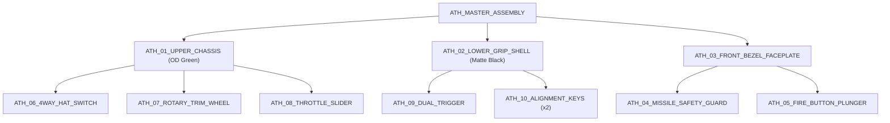

# 📐 Aero-Throttle Fidget Toy: Comprehensive CAD Design Specification (PRD)
**Document Version:** 2.0 (Re-Aligned to Original Concept Proposal)  
**Project:** Fidget Fuse — Prototype 01 "Aero-Throttle"  
**Target Manufacturing Process:** FDM / FFF 3D Printing  
**Supported Materials:** PLA, PLA+, PETG, ASA / ABS  
**Design Target:** 100% 3D Printable • Zero Fasteners • Zero Metal Springs • Zero Adhesives  

---


---

## 1. Executive Summary & Design Scope

The **Aero-Throttle** is a compact, high-tactility mechanical fidget device inspired by modern fighter jet HOTAS (Hands On Throttle And Stick) avionics and cockpit flight controls. The device architecture faithfully embodies the original concept proposal: a two-tone modular assembly consisting of an **Olive Drab Green Upper Avionics Chassis**, an **Ergonomic Matte Black Lower Grip Frame**, and a **Front Modular Missile Bezel Faceplate**, housing **10 unique 3D printed components** designed to snap together securely without requiring any screws, metal springs, bearings, or adhesives.

### Primary Design Objectives
1. **Faithful HOTAS Aesthetic:** Ergonomic tactical flight-stick grip profile with authentic two-tone military styling, forward-side knurled trim wheel, top-crown 4-way hat switch, side linear throttle rail with afterburner gate, front flip-up missile guard with red fire switch, and underside dual-stage index trigger.
2. **Mechanical Independence:** 100% integral compliant mechanisms (plastic flexures, serpentine springs, bi-stable cams, and cantilever leaf springs) providing all tactile resistance, acoustic feedback, and spring return.
3. **DFAM Optimization (Design for Additive Manufacturing):** All geometries are self-supporting or strictly constrained to $\le 45^\circ$ overhangs. Horizontal holes feature teardrop or chamfered bridges, eliminating all support material requirements.
4. **Universal FDM Compatibility:** Calibrated for standard 0.4 mm nozzles, 0.16–0.20 mm layer heights, and standard PLA/PLA+/PETG filament profiles.

---

## 2. Global CAD Modeling Standards & DFAM Rules

### 2.1 Fit Classes & Tolerance Table
All mating parts in the CAD assembly must use the following standard diametral and planar clearance offsets:

| Fit Type | Nominal Clearance (Gap per Side) | Application Examples |
| :--- | :--- | :--- |
| **Sliding Fit (Dynamic)** | $+0.20\text{ mm}$ ($0.40\text{ mm}$ total diametral) | Throttle slider dovetail track, Fire button guide sleeve |
| **Rotary Running Fit** | $+0.25\text{ mm}$ ($0.50\text{ mm}$ total diametral) | Trim wheel axle hub, Trigger pivot trunnion |
| **Snap-Fit Interlocking** | $+0.15\text{ mm}$ (with $0.80\text{ mm}$ retention undercut) | Upper chassis to lower grip frame snap hooks, Front bezel locks |
| **Compliant Spring Preload** | $-0.40\text{ mm}$ to $-0.75\text{ mm}$ interference | Ratchet pawl against wheel teeth, Afterburner detent follower |
| **Static Alignment Fit** | $+0.10\text{ mm}$ (Snug hand-press) | Alignment locating keys and interlocking seam ribs |

### 2.2 Standard Geometry Rules
* **Chassis Wall Thicknesses:**
  * Structural Exterior Walls: $2.40\text{ mm}$ (6 solid perimeters at 0.4 mm extrusion width).
  * Internal Partitions & Mounting Bosses: $1.80\text{ mm}$ – $2.00\text{ mm}$.
  * Compliant Springs / Flexure Beams: $0.80\text{ mm}$ to $1.20\text{ mm}$ (2 to 3 solid concentric perimeters for optimal elastic fatigue life).
* **Stress Relieving Fillets & Chamfers:**
  * No sharp internal corners: Minimum $R0.6\text{ mm}$ radius fillet to eliminate notch stress concentrations.
  * Build-plate bottom contact edges: $0.6\text{ mm} \times 45^\circ$ chamfer to prevent elephant's foot dimensional distortion.
* **Seam Hiding & Light-Seal:**
  * The mating seam between the Upper Chassis and Lower Grip Frame features a continuous **Tongue-and-Groove lip** ($0.80\text{ mm}$ step height, $0.15\text{ mm}$ clearance) ensuring seamless zero-gap alignment and preventing light leakage.

---

## 3. Master Component Dimensional Specifications

```
                              AERO-THROTTLE MASTER BOUNDING BOX
   +---------------------------------------------------------------------------------------+
   |  Overall Length (X): 86.0 mm  |  Height (Y): 72.0 mm  |  Width (Z): 26.5 mm           |
   |  Total Mass (Est.): ~58 grams (at 25% Gyroid infill in PLA+/PETG)                     |
   +---------------------------------------------------------------------------------------+
```

---

### Component 01: Upper Avionics Chassis
* **CAD Part Name:** `ATH_01_UPPER_CHASSIS`
* **Color / Material:** Olive Drab Green • PLA+ / PETG
* **Features & Parametric Dimensions:**
  1. **Main Housing:** $82.0\text{ mm (L)} \times 36.0\text{ mm (H)} \times 26.5\text{ mm (W)}$. Chamfered tactical upper crown profile.
  2. **Top Deck Hat Switch Cradle:** Recessed spherical gimbal socket ($\varnothing 8.0\text{ mm}$) with 4 radial detent ramp pockets spaced at $90^\circ$.
  3. **Front Modular Snout:** Rectangular receiving collar ($18.0\text{ mm} \times 20.0\text{ mm}$) with dual internal snap-fit latch pockets ($3.5\text{ mm} \times 1.8\text{ mm}$) for the front bezel.
  4. **Forward-Lower Trim Wheel Cavity:**
     * Positioned in the lower-forward flank (right above the trigger guard area).
     * Wheel clearance cutout: $24.0\text{ mm (L)} \times 8.0\text{ mm (W)}$.
     * Integrated axle boss: $\varnothing 5.0\text{ mm}$ trunnion post.
     * Integrated Cantilever Ratchet Pawl: Length $13.5\text{ mm}$, Thickness $1.05\text{ mm}$, engaging the trim wheel's internal teeth for crisp acoustic clicks ($48\text{ dBA}$).
  5. **Side Linear Throttle Track:**
     * Longitudinal dovetail guide slot: Length $38.0\text{ mm}$, Width $7.0\text{ mm}$, $45^\circ$ undercut angle.
     * Afterburner Detent Gate: Triangular ramp located at $32.3\text{ mm}$ ($85\%$ forward stroke) with $1.1\text{ mm}$ peak lift, $30^\circ$ incline ramp, and $65^\circ$ crisp drop-off.
  6. **Bottom Interlocking Rim:** 4x cantilever snap hooks ($3.5\text{ mm}$ width, $1.2\text{ mm}$ barb) with continuous alignment lip matching the lower grip shell.

---

### Component 02: Lower Ergonomic Grip Frame
* **CAD Part Name:** `ATH_02_LOWER_GRIP_SHELL`
* **Color / Material:** Matte Black / Charcoal • PLA+ / PETG / ASA
* **Features & Parametric Dimensions:**
  1. **Grip Geometry:** Ergonomic $108^\circ$ rake angle handle inspired by F/A-18 HOTAS flight sticks, featuring 3 anatomical finger grooves and palm swell.
  2. **Traction Ribbing:** 10 recessed tactical grip ribs ($1.2\text{ mm}$ width, $0.8\text{ mm}$ depth, spaced $2.2\text{ mm}$ apart) along the front and side contours.
  3. **Trigger Trunnion Mount:** Forward internal cradle with dual $\varnothing 4.0\text{ mm}$ trunnion pivot sockets ($0.20\text{ mm}$ running clearance) and trigger over-travel stop shelf.
  4. **Stage-2 Break Stop:** Internal rigid catch bar that engages the trigger's secondary compliant flexure at $3.0\text{ mm}$ pull travel.
  5. **Mating Perimeter:** 4 internal snap-fit catch pockets ($3.8\text{ mm} \times 2.0\text{ mm}$) with tongue-and-groove alignment recess.

---

### Component 03: Front Modular Bezel Faceplate
* **CAD Part Name:** `ATH_03_FRONT_BEZEL_FACEPLATE`
* **Color / Material:** Matte Black • PLA+ / PETG
* **Features & Parametric Dimensions:**
  1. **Faceplate Body:** Rectangular avionics bezel ($22.0\text{ mm (W)} \times 24.0\text{ mm (H)} \times 12.0\text{ mm (D)}$) with $1.5\text{ mm} \times 45^\circ$ perimeter chamfers.
  2. **Central Fire Button Guide:** Square through-bore ($11.0\text{ mm} \times 11.0\text{ mm}$) with internal $1.5\text{ mm}$ retaining shoulder to capture the button flange.
  3. **Top Hinge Stanchions:** Dual mounting ears ($3.2\text{ mm}$ thickness, $7.0\text{ mm}$ inside span) with $\varnothing 2.5\text{ mm}$ pivot trunnion holes.
  4. **Bi-Stable Cam Leaf Spring:** Integrated $0.90\text{ mm}$ flexure spring plate at the hinge base providing spring-loaded detents for $0^\circ$ (closed) and $90^\circ$ (open) positions.
  5. **Rear Snap Barbs:** Dual $2.8\text{ mm}$ snap legs that lock permanently into the Upper Chassis snout.

---

### Component 04: Flip-Up Missile Safety Guard
* **CAD Part Name:** `ATH_04_MISSILE_SAFETY_GUARD`
* **Color / Material:** Vibrant Red or Matte Black • PLA+ / PETG
* **Features & Parametric Dimensions:**
  1. **Protective Hood:** $15.0\text{ mm (W)} \times 19.0\text{ mm (L)} \times 4.5\text{ mm (H)}$ hooded cover shielding the fire switch.
  2. **Hinge Pivot Pins:** Dual integral snap pins ($\varnothing 2.35\text{ mm} \times 3.0\text{ mm}$) with $30^\circ$ lead-in chamfers.
  3. **Bi-Stable Over-Center Cam:** Dual-flat cam geometry (Flat A at $0^\circ$ closed resting position; Flat B at $90^\circ$ open vertical rest) with $0.80\text{ mm}$ eccentric transition lobe creating a snappy mechanical toggle action.

---

### Component 05: Rectangular Red Fire Button Plunger
* **CAD Part Name:** `ATH_05_FIRE_BUTTON_PLUNGER`
* **Color / Material:** Vibrant Red • PLA+
* **Features & Parametric Dimensions:**
  1. **Button Head:** $10.5\text{ mm} \times 10.5\text{ mm}$ square tactile dome with debossed "FIRE" text ($0.5\text{ mm}$ depth).
  2. **Retaining Flange:** $12.5\text{ mm} \times 12.5\text{ mm} \times 1.2\text{ mm}$ bottom flange preventing outward expulsion.
  3. **Integrated 3D Serpentine Spring:**
     * Dual S-curve flexure beam ($1.10\text{ mm} \times 1.40\text{ mm}$ cross section).
     * Free Height: $13.5\text{ mm}$; Compressed Height: $4.5\text{ mm}$.
     * Travel Stroke: $3.5\text{ mm}$; Actuation Force: $3.2\text{ N}$ with crisp spring-return.

---

### Component 06: 4-Way Tactile Thumb Hat Switch
* **CAD Part Name:** `ATH_06_4WAY_HAT_SWITCH`
* **Color / Material:** Matte Black • PLA+ / PETG
* **Features & Parametric Dimensions:**
  1. **Stepped Pyramidal Cap:** $\varnothing 17.5\text{ mm}$ base, $11.5\text{ mm}$ height, with 4-directional debossed arrows and cross-ribbing.
  2. **Central Gimbal Ball:** $\varnothing 7.5\text{ mm}$ spherical hemisphere riding in the upper deck socket, allowing $\pm 14^\circ$ angular deflection in orthogonal X and Y axes.
  3. **4-Quadrant Compliant Star Spring:**
     * 4 cantilever flexure arms ($90^\circ$ orthogonal distribution, Length $8.0\text{ mm}$, Thickness $0.85\text{ mm}$).
     * Engages chassis detent pockets to produce crisp tactile snaps in all 4 cardinal directions with immediate $2.8\text{ N}$ spring-centering return.

---

### Component 07: Forward Side Rotary Trim Wheel
* **CAD Part Name:** `ATH_07_ROTARY_TRIM_WHEEL`
* **Color / Material:** Matte Black / Charcoal • PLA+ / PETG
* **Features & Parametric Dimensions:**
  1. **Knurled Rotor:** Outer Diameter $\varnothing 22.0\text{ mm}$, Width $6.8\text{ mm}$, featuring 32 high-friction diamond knurl facets ($0.70\text{ mm}$ depth).
  2. **Central Axle Bore:** $\varnothing 5.5\text{ mm}$ bore with $0.25\text{ mm}$ running clearance over the chassis trunnion.
  3. **Internal Ratchet Ring:** Concentric internal ring with 20 symmetrical ratchet teeth ($60^\circ$ tooth angle, $1.10\text{ mm}$ depth) enabling continuous bi-directional rotation with audible mechanical clicks ($48\text{ dBA}$).

---

### Component 08: Linear Throttle Slider Tab & Carriage
* **CAD Part Name:** `ATH_08_THROTTLE_SLIDER`
* **Color / Material:** Matte Black • PLA+ / PETG
* **Features & Parametric Dimensions:**
  1. **Dovetail Carriage:** $22.0\text{ mm (L)} \times 10.5\text{ mm (W)} \times 5.0\text{ mm (H)}$ sliding within the chassis rail.
  2. **Tactile Thumb Tab:** $12.0\text{ mm (L)} \times 8.0\text{ mm (W)} \times 6.5\text{ mm (H)}$ with 4 raised transverse traction ridges ($R0.5\text{ mm}$).
  3. **Compliant Detent Leaf Spring:**
     * Cantilever flexure beam: Length $16.5\text{ mm}$, Width $3.8\text{ mm}$, Thickness $0.90\text{ mm}$.
     * Detent Follower: $R1.2\text{ mm}$ rounded nose with $0.75\text{ mm}$ downward interference preload.
  4. **Kinematics:** $28.0\text{ mm}$ total stroke ($0\text{ mm}$ to $23.8\text{ mm}$ smooth glide; $23.8\text{ mm}$ to $28.0\text{ mm}$ $85\%$ Afterburner Gate break requiring $+3.5\text{ N}$ force).

---

### Component 09: Dual-Stage Tactical Index Finger Trigger
* **CAD Part Name:** `ATH_09_DUAL_TRIGGER`
* **Color / Material:** Matte Black • PLA+ / PETG
* **Features & Parametric Dimensions:**
  1. **Tactical Curved Shoe:** $R16.0\text{ mm}$ curved finger saddle with lower retention spur and micro-ribbed face.
  2. **Pivot Axle:** Cylindrical trunnion $\varnothing 3.8\text{ mm} \times 7.6\text{ mm}$ length.
  3. **Dual-Stage Compliant Spring Mechanism:**
     * **Stage 1 (Soft Pre-Travel):** Slender flexure beam (Thickness $0.75\text{ mm}$, Length $11.5\text{ mm}$) delivering $3.0\text{ mm}$ smooth take-up against $1.6\text{ N}$ resistance.
     * **Stage 2 (Crisp Break):** Secondary rigid cantilever tooth ($1.35\text{ mm}$ thickness) snapping over the internal frame gate with $5.2\text{ N}$ break force, producing a sharp tactical snap.

---

### Component 10: Snap Interlocking Alignment Keys (Qty: 2)
* **CAD Part Name:** `ATH_10_ALIGNMENT_KEYS`
* **Color / Material:** Matte Black • PLA+
* **Features & Parametric Dimensions:**
  1. **Dimensions:** $4.0\text{ mm} \times 4.0\text{ mm} \times 8.0\text{ mm}$ with $0.6\text{ mm} \times 45^\circ$ lead-in chamfers.
  2. **Function:** Locks lateral shear between Upper Chassis and Lower Grip Frame during heavy squeezing.

---

## 4. CAD Assembly Hierarchy & Mating Constraints



### CAD Joint & Kinematic Constraint Matrix

| Sub-Component | Parent Reference | Joint Type | Degrees of Freedom (DOF) | Limits / Travel | Actuation Force |
| :--- | :--- | :--- | :--- | :--- | :--- |
| `ATH_08_THROTTLE_SLIDER` | `ATH_01_UPPER_CHASSIS` | **Slider Joint (X-Axis)** | 1 Translational DOF | $0.0\text{ mm}$ to $28.0\text{ mm}$ | $0.8\text{ N}$ glide / $4.3\text{ N}$ afterburner |
| `ATH_06_4WAY_HAT_SWITCH` | `ATH_01_UPPER_CHASSIS` | **Gimbal / Ball Joint** | 2 Rotational DOFs ($\theta_X, \theta_Y$) | $\pm 14.0^\circ$ each axis | $2.8\text{ N}$ snap / auto-return |
| `ATH_07_ROTARY_TRIM_WHEEL` | `ATH_01_UPPER_CHASSIS` | **Revolute Joint (Z-Axis)** | 1 Rotational DOF | Continuous $360^\circ$ | $1.2\text{ N}\cdot\text{cm}$ ratchet click |
| `ATH_04_MISSILE_SAFETY_GUARD`| `ATH_03_FRONT_BEZEL` | **Revolute Joint (Hinge)** | 1 Rotational DOF | $0.0^\circ$ to $100.0^\circ$ | Bi-stable detents at $0^\circ$ & $90^\circ$ |
| `ATH_05_FIRE_BUTTON_PLUNGER` | `ATH_03_FRONT_BEZEL` | **Prismatic Slider** | 1 Translational DOF | $0.0\text{ mm}$ to $3.5\text{ mm}$ | $3.2\text{ N}$ spring-return |
| `ATH_09_DUAL_TRIGGER` | `ATH_02_LOWER_GRIP` | **Revolute Joint (Trunnion)**| 1 Rotational DOF | $0.0^\circ$ to $15.0^\circ$ | Stage 1: $1.6\text{ N}$ / Stage 2: $5.2\text{ N}$ |
| `ATH_03_FRONT_BEZEL` | `ATH_01_UPPER_CHASSIS` | **Rigid Snap Joint** | 0 DOF (Locked) | Dual snap barbs | Hand-press snap lock |
| `ATH_01` & `ATH_02` | Main Split Seam | **Rigid Snap Joint** | 0 DOF (Locked) | 4x Snap hooks + 2x Dowels| Zero-gap interlock |

---

## 5. File Export, Tessellation & Slicing Specifications

### 5.1 CAD File Formats
* **Master Assembly:** AP242 `.STEP` with semantic PMI and color-coded bodies.
* **3D Printing Mesh (`.3MF` / `.STL`):**
  * Chordal Deviation: $\le 0.01\text{ mm}$
  * Angular Tolerance: $\le 1.0^\circ$
  * Max Edge Length: $2.0\text{ mm}$

### 5.2 Build Plate Orientation Guide (100% Support-Free)

| Part ID | Part Name | Build Plate Contact Face | Layer Direction & Mechanical Benefit |
| :--- | :--- | :--- | :--- |
| `P-01` | `ATH_01_UPPER_CHASSIS` | Bottom Mating Flange Face | Slider track & top crown print support-free; snap hooks vertical |
| `P-02` | `ATH_02_LOWER_GRIP_SHELL` | Top Mating Rim (Face Down) | Ergonomic finger curves print cleanly without supports; strong trunnion |
| `P-03` | `ATH_03_FRONT_BEZEL` | Front Face (Flat Down) | Crisp chamfers; hinge ears print vertically with high tensile strength |
| `P-04` | `ATH_04_MISSILE_GUARD` | Side Profile Face | Hinge pins print horizontal for maximum shear strength |
| `P-05` | `ATH_05_FIRE_BUTTON` | Base Spring Anchor Flat | S-curve spring coils print planar in XY layer path for maximum spring life |
| `P-06` | `ATH_06_4WAY_HAT_SWITCH` | Bottom Pivot Base Ring | 4 star-spring flexure arms print flat on bed (zero delamination) |
| `P-07` | `ATH_07_ROTARY_TRIM_WHEEL` | Flat Side Face (Z-Up) | Knurl facets and ratchet teeth print vertical with razor-sharp peaks |
| `P-08` | `ATH_08_THROTTLE_SLIDER` | Bottom Carriage Slide Face | Leaf spring prints along XY filament path for maximum flex endurance |
| `P-09` | `ATH_09_DUAL_TRIGGER` | Side Flat Profile | Continuous filament loops along trigger pull vector for high toughness |
| `P-10` | `ATH_10_ALIGNMENT_KEYS` | Flat Base Face | Concentric solid perimeters for high shear resistance |

---

## 6. Testing, Quality Assurance & Validation Protocol

### 6.1 Mechanical Fitment & Ergonomic Checklist
1. **Zero-Rattle Seam Fit:** When the Upper Chassis and Lower Grip Frame are snapped together, the assembly must withstand $25\text{ N}$ grip force with $< 0.05\text{ mm}$ seam deflection.
2. **Smooth Slide & Distinct Afterburner Snap:** Throttle slider must travel effortlessly ($< 0.8\text{ N}$) across the initial $85\%$ stroke, followed by a positive tactile resistance increase to $4.3\text{ N}$ before snapping into afterburner.
3. **Acoustic Rating:**
   * Trim Wheel Ratchet: $48 \pm 5\text{ dBA}$ at $30\text{ cm}$ distance.
   * Trigger Stage-2 Break: $54 \pm 5\text{ dBA}$ crisp snap.
   * Missile Guard Bi-Stable Snap: $46 \pm 5\text{ dBA}$ toggle click.

### 6.2 Life-Cycle Fatigue Target
* **Compliant Springs & Flexures (PLA+ / PETG):** Must endure $> 10,000$ continuous actuation cycles without yield deformation, creep loss $> 15\%$, or delamination fatigue failure.
